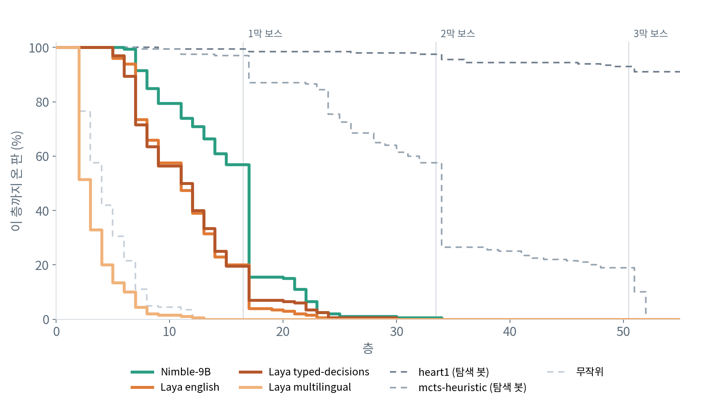
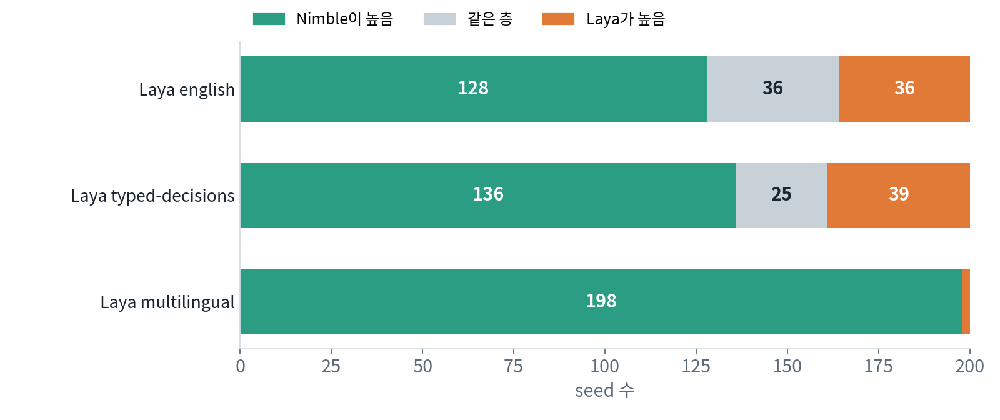
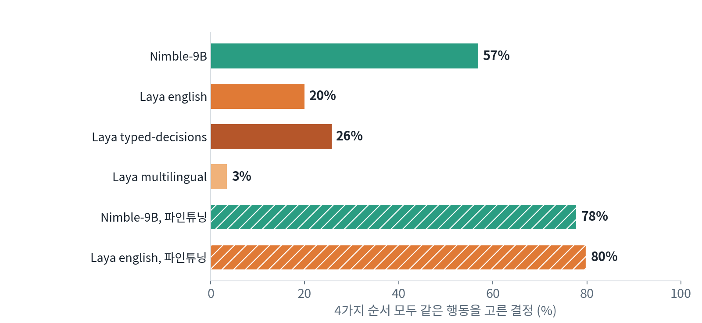
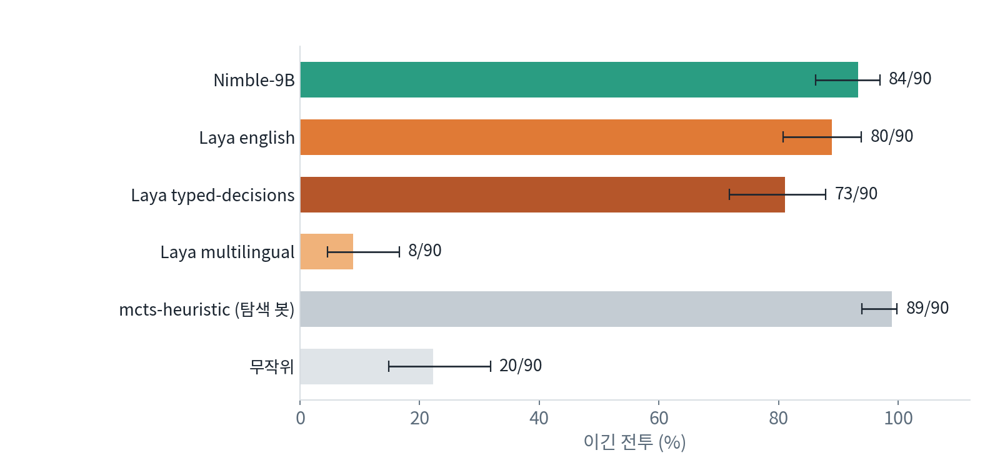
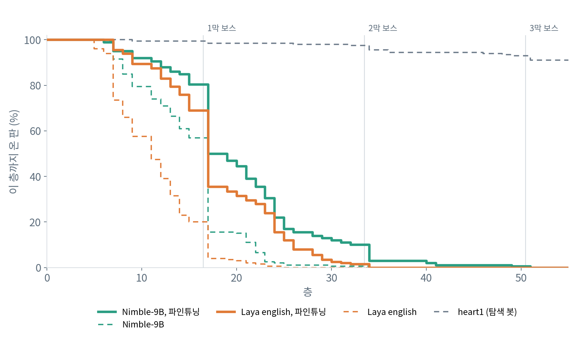

[English](README.md) · [한국어](README.ko.md) · [中文](README.zh-cn.md)

# typed-decision-slay-the-spire

typed-decision 모델이 헤드리스 시뮬레이터 위에서 Slay the Spire 한 판의 모든 선택을 내리게 하는 저장소다. 시작 축복과 카드 보상부터 전투에서 낼 카드 한 장까지 모델이 고른다.

Bespoke Nimble-9B와 Convai Laya 체크포인트 3종을 model-compose로 띄워 NVIDIA DGX Spark에서 돌렸다. 모든 모델이 같은 텍스트를 읽고, 같은 seed 200개를 아이언클래드, 승천 0으로 플레이했다. 비교는 두 번 했다. 한 번은 학습 없이(zero-shot), 한 번은 Nimble-9B와 Laya english를 탐색 봇의 같은 결정으로 한 번씩 파인튜닝한 뒤다. 두 라운드 모두 실행 전에 설정과 분석 방법을 사전 등록했다. 모든 수치는 실행 결과에서 나왔고 사람이 판정한 것은 없다. 측정은 DGX Spark에서만 했다.

## 목차

- [빠른 시작](#빠른-시작)
- [요약](#요약)
- [1 실험 환경](#1-실험-환경)
- [2 돌리는 데 드는 것](#2-돌리는-데-드는-것)
- [3 결과](#3-결과)
  - [3.1 모델별 도달 층](#31-모델별-도달-층)
  - [3.2 모델이 선택지를 읽는가](#32-모델이-선택지를-읽는가)
  - [3.3 같은 엘리트 전투](#33-같은-엘리트-전투)
  - [3.4 질문 문장 바꾸기](#34-질문-문장-바꾸기)
  - [3.5 파인튜닝 후](#35-파인튜닝-후)
- [4 권고](#4-권고)
- [5 한계와 측정하지 않은 것](#5-한계와-측정하지-않은-것)
  - [신뢰구간이 담는 것](#신뢰구간이-담는-것)
  - [사전 등록과 달라진 점](#사전-등록과-달라진-점)
  - [소프트웨어 환경의 영향](#소프트웨어-환경의-영향)
  - [모델이 읽지 못한 입력](#모델이-읽지-못한-입력)
  - [그 밖의 한계](#그-밖의-한계)
- [라이선스](#라이선스)

## 모델

typed-decision 모델은 텍스트와 허용된 답 목록을 받아 그중 하나를 고르고, 답마다 확률을 돌려준다. 자유 텍스트를 쓰지 않으므로 목록 밖의 답은 낼 수 없다.

| 플레이어 | 모델 | 크기 | 고르는 방식 |
|---|---|---|---|
| `nimble` | [`bespokelabs/Bespoke-Nimble-9B`](https://huggingface.co/bespokelabs/Bespoke-Nimble-9B), [`Qwen/Qwen3.5-9B`](https://huggingface.co/Qwen/Qwen3.5-9B)에 얹은 LoRA 어댑터 | 9B | 언어 모델이 답 글자에 주는 logit을 읽는다 |
| `laya-english` | [`convaiinnovations/laya`](https://huggingface.co/convaiinnovations/laya)의 english 체크포인트 | 421M | 인코더(ModernBERT-large)와 선택 헤드 |
| `laya-typed` | 같은 저장소의 typed-decisions 체크포인트(english를 Convai가 업무 워크플로 4종으로 파인튜닝) | 421M | 같음 |
| `laya-multilingual` | 같은 저장소의 multilingual 체크포인트 | 322M | 같음 |
| `nimble-ft` | [`MindrLabs/sts-arena-nimble-ft`](https://huggingface.co/MindrLabs/sts-arena-nimble-ft): Nimble-9B 어댑터를 이 게임으로 1 epoch 더 학습 | 9B | Nimble-9B와 같음 |
| `laya-english-ft` | [`MindrLabs/sts-arena-laya-english-ft`](https://huggingface.co/MindrLabs/sts-arena-laya-english-ft): Laya english를 이 게임으로 1 epoch 전체 파인튜닝 | 421M | Laya english와 같음 |

## 데모


벤치마크와 별개로 실제 게임에서 돌린 시연이다. Nimble-9B(왼쪽)와 Laya english(오른쪽)가 같은 seed로 둘 다 1막 보스와 싸우고 있다. 게임 아래에는 지금 결정의 선택지와, 4가지 선택지 순서 가운데 몇 번이 각 선택지를 골랐는지가 나온다.

## 빠른 시작

[model-compose](https://github.com/hanyeol/model-compose) 0.4.113 이상, [uv](https://docs.astral.sh/uv/), CMake 3.19 이상, C++20 컴파일러가 필요하다. NVIDIA GPU가 있는 Linux(DGX Spark)에서 돌렸다.

uv로 model-compose를 설치한다:

```bash
uv pip install model-compose
```

pip로 설치해도 된다:

```bash
pip install model-compose
```

저장소를 받아 준비한다:

```bash
git clone https://github.com/MindrLabs/typed-decision-slay-the-spire
cd typed-decision-slay-the-spire
scripts/fetch-game-text.sh      # 모델이 읽는 게임 텍스트를 data/sts1에 받는다
scripts/setup-simulator.sh      # 시뮬레이터와 러너용 .venv를 만든다
scripts/setup-runtimes.sh       # 공개 실행과 같은 패키지로 모델 런타임을 만든다
```

모델을 띄운다:

```bash
model-compose up
```

다른 터미널에서 모델이 seed 1을 플레이하게 한다:

```bash
uv run python -m arena.run --player nimble --seeds 1 --perms 4
```

실행하면 `runs/nimble/games.jsonl`(판마다 한 줄: 도달 층, 결과, 결정 수)과 `runs/nimble/seed-1.jsonl`(결정마다 모델이 읽은 상태와 선택지, 순서별 선택, 다수결 선택)이 생긴다. `--player`에는 [모델](#모델) 표의 이름이나 `random`을 넣는다. `--perms 4`는 사전 등록한 설정으로, 결정마다 선택지를 4가지 순서로 물어 다수결로 고른다. 빼면 시뮬레이터 순서로 한 번만 묻는다.

gradio 화면은 `http://localhost:8081`, HTTP API는 `http://localhost:8080/api`에 열린다.
`SERVER_PORT`, `PORT`로 각 포트를 바꾼다. 러너는 API 주소를 `ARENA_SERVER`에서 읽는다.

| 첫 실행 | 하는 일 |
| :---: | --- |
| 게임 텍스트 | `fetch-game-text.sh`가 [spire-archive](https://github.com/nkhoit/spire-archive) `687e6dce`에서 파일 5개(카드, 유물, 포션, 이벤트, 몬스터)를 받고 sha256을 확인한다. 게임의 텍스트이므로 이 저장소에는 넣지 않았다 |
| 시뮬레이터 | `setup-simulator.sh`가 [sts_lightspeed](https://github.com/daniel-ziegler/sts_lightspeed) `84ab3ead`를 받아 `patches/sts_dz`의 커밋 5개를 적용하고, uv로 러너용 `.venv`를 만든 뒤 `slaythespire` 파이썬 모듈을 빌드해 넣는다 |
| 가상환경 | `setup-runtimes.sh`가 `runtimes/nimble.txt`, `runtimes/laya.txt`대로 모델마다 환경을 `.runtime/` 아래에 만든다. 버전과 wheel 해시로 고정했다(둘 다 torch 2.14.0). `scripts/env-report.sh`는 다시 돌린 결과와 함께 적을 GPU, 드라이버, 패키지를 출력한다 |
| 체크포인트 | 모델은 첫 요청 때 올라온다. Nimble-9B는 어댑터(0.19GB)와 `Qwen/Qwen3.5-9B`(19.3GB)를 받아 한 번만 `~/.cache/models/nimble-merged`(18.8GB)로 병합한다. Laya 3종은 `convaiinnovations/laya`(2.4GB)를 함께 쓴다. 파인튜닝 모델은 `MindrLabs/sts-arena-nimble-ft`(1.3GB, 학습 중간 체크포인트 2개 포함)를 받아 같은 기반 모델에 병합하고(18.8GB 추가), `MindrLabs/sts-arena-laya-english-ft`(1.7GB)를 받는다. 토큰은 필요 없고, `HF_TOKEN`은 다운로드 속도 제한만 올려 준다 |

결과에 나오는 탐색 봇 두 개는 모델 서버 없이 돈다:

```bash
scripts/setup-simulator.sh --heart1      # heart1의 체크포인트(23MB)를 받는다
uv run --extra baselines python -m arena.bench --players mcts-heuristic,heart1 --seeds 1-200 --out runs/main
```

한 라운드 전체를 다시 돌리거나, 아래 표와 그림을 모두 `results/`의 파일에서 다시 계산하려면:

```bash
uv run python -m arena.bench --players nimble,laya-english,laya-typed,laya-multilingual \
  --seeds 1-200 --perms 4 --workers nimble=4 --out runs/final
uv run python scripts/stats.py results/final --refs results/main --single results/main \
  --wording results/wording --elite results/elite --latency results/latency --out reports/round1
uv run python scripts/stats_round2.py --out reports/round2
uv run python scripts/sensitivity.py
uv run python scripts/charts.py
```

요청 예:

```bash
curl localhost:8080/api/workflows/runs -H 'Content-Type: application/json' -d '{
  "workflow_id": "nimble",
  "input": {
    "text": "Floor 5, campfire. HP 31/80. Next floor: an elite fight.",
    "schema": {"pick": {"type": "enum", "choices": ["A", "B"],
      "description": "Which option gives the best chance of winning this Slay the Spire run?",
      "choice_descriptions": {"A": "Rest: heal 24 HP.", "B": "Smith: upgrade Bash."}}}
  }
}'
```

`{"decision": {"pick": "A"}, "fields": {"pick": {"scores": {"A": 0.62, "B": 0.38}}}}`가 돌아온다. Laya 워크플로는 같은 질문을 `{"type": "choice", "instructions": ..., "criteria": {"A": ..., "B": ...}}`로 받는다.

## 요약

1. 학습 없이도 Nimble-9B가 모든 Laya 모델보다 높이 올라갔다. 평균 도달 층은 14.1로, Laya english 10.4, typed-decisions 10.6, multilingual 2.4다. 같은 seed끼리 비교하면 Laya english에 128번 이기고 36번 비기고 36번 졌다. 텍스트 모델은 한 판도 이기지 못했다. 탐색 봇 heart1은 평균 53층에 200판 중 165승이다.
2. Nimble-9B는 선택지를 더 잘 읽는다. 같은 결정을 선택지 순서만 4가지로 바꿔 물으면, 결정의 57%에서 네 번 모두 같은 행동을 골랐다. Laya english는 20%, typed-decisions는 26%, multilingual은 3%다. 4가지 순서의 다수결을 쓰자 Nimble-9B는 1.2층 올랐고, Laya english와 typed-decisions는 그대로였으며, multilingual은 5.8층에서 2.4층으로 떨어졌다. multilingual의 이전 점수는 앞쪽 선택지를 고르는 버릇에서 나온 것이었다.
3. 같은 덱으로 같은 1막 엘리트와 싸우면 Nimble-9B와 Laya english의 승률은 비슷하다(90번 중 84번과 80번). 둘의 차이는 전투 한 번이 아니라 판 전체의 다른 선택에서 쌓인다.
4. 탐색 봇의 같은 결정 39,884개로 한 번씩 파인튜닝하자 Laya english는 6.7층(10.4에서 17.1), Nimble-9B는 5.4층(14.1에서 19.5) 올랐다. 파인튜닝한 Nimble-9B가 여전히 2.4층 앞선다. 다만 학습 시간도 17배 길었으므로(7.9시간 대 0.5시간), 이 차이에는 모델과 학습 예산이 함께 들어 있다. 두 모델 모두 결정의 약 80%에서 모든 순서에 같은 행동을 골랐다. 이긴 판은 여전히 없다.
5. Laya는 시간과 메모리를 6분의 1만 쓴다. DGX Spark에서 요청당 24ms, 약 3GB이고, Nimble-9B는 146ms, 19GB다.

표 1: 모델별 요약(모델마다 seed 200개, 결정마다 선택지 순서 4가지)

| 모델 | 평균 도달 층, 무학습 | 평균 도달 층, 파인튜닝 | 4가지 순서 모두 같은 선택, 무학습 → 파인튜닝 | 요청당 시간 | GPU 메모리 |
|---|---|---|---|---|---|
| Nimble-9B | 14.1 | 19.5 | 57% → 78% | 146ms | 19GB |
| Laya english | 10.4 | 17.1 | 20% → 80% | 24ms | 약 3GB |
| Laya typed-decisions | 10.6 | 학습 안 함 | 26% | 24ms | 약 3GB |
| Laya multilingual | 2.4 | 학습 안 함 | 3% | 14ms | 약 3GB |
| 참고: heart1(탐색 봇) | 53.2, 165승 | | | | |

## 1 실험 환경

표 2: 장비와 소프트웨어

| 항목 | 값 |
|---|---|
| 장비 | NVIDIA DGX Spark: GB10, 드라이버 580.126.09, CUDA 13.0, 통합 메모리 128GB. 다른 작업과 함께 쓰는 장비 |
| 모델 서버 | model-compose `e8ce0d4b`(1라운드), 여기에 로컬 커밋 `3f31d447`을 더한 것(2라운드). 이 저장소는 같은 모델을 PyPI의 model-compose 0.4.113으로 띄운다 |
| 모델 런타임 | 두 계열 모두 torch 2.14.0. Nimble-9B는 flash-linear-attention 0.5.2, Laya는 `laya` 0.3.20(`runtimes/*.txt`) |
| 가중치 | Nimble-9B 어댑터 `bd792f44`, 기반 `Qwen/Qwen3.5-9B` `c2022362`. Laya `55cf4c4e`(model-compose가 Laya의 revision을 받지 않아 고정하지 못하고 기록만 했다) |
| 시뮬레이터 | gamerpuppy가 C++로 다시 구현한 Slay the Spire를 Daniel Ziegler가 포크한 sts_lightspeed `84ab3ead`에, 게임 상태를 파이썬에 더 내보내는 커밋 5개를 더했다 |
| 실행 | 아이언클래드, 승천 0, 모든 플레이어가 seed 1-200 |

- **모델이 읽는 것.** 결정마다 상태 텍스트(층, HP, 골드, 덱, 유물, 포션. 전투 중이면 손패, 에너지, 적마다 HP, 의도, 파워까지)와 문장으로 쓴 선택지 목록을 받는다. 카드, 유물, 이벤트 설명은 게임 텍스트에서 가져온다. 모든 모델이 같은 텍스트를 받는다. 선택지 텍스트는 ModernBERT 토크나이저로 한 번만 320토큰에 맞췄고, 결정의 1.6%에서 선택지 하나 이상이 줄었다.
- **모델이 정하는 것.** 전투 안팎의 모든 것이다. 시작 축복, 지도 경로, 카드 보상, 상점, 모닥불, 이벤트, 전투의 카드와 포션 하나하나를 정한다. 예외는 설명할 선택지가 없는 기억력 미니게임 Match and Keep 하나로, 시뮬레이터의 휴리스틱이 둔다. 선택지가 하나뿐인 결정은 자동으로 진행한다.
- **선택지 순서 4가지.** 선택지가 3개 이상인 결정은 4가지 순서(seed로 정한 섞기 두 개와 그 역순)로 묻고, 가장 많이 뽑힌 행동을 둔다. 선택지가 2개면 2가지 순서다. 동점이면 순서별 순위 점수의 합, 그래도 같으면 seed로 정한 추첨으로 가른다. 그러면 내용이 아니라 위치로 고르는 모델은 게임을 좌우하지 못한다. 4가지 순서는 앞쪽이나 뒤쪽을 꾸준히 고르는 버릇은 상쇄하지만, 모든 회전을 평균할 때처럼 모든 선택지를 모든 자리에 한 번씩 놓지는 않는다.
- **기준 플레이어.** heart1(전투 밖은 silverbot의 정책망, 전투는 시뮬레이터의 전투 탐색)과 mcts-heuristic(시뮬레이터의 휴리스틱과 전투 탐색)은 텍스트를 읽지 않고 같은 seed를 둔다. 탐색은 앞으로 뽑을 카드와 다른 무작위 결과를 읽지 않고 표본으로 뽑는다. 경쟁자가 아니라 규모를 보여 주는 상한선이다. random은 균등하게 무작위로 고른다.
- **탐색적 분석.** 사전 등록에 없던 분석에는 *(탐색적)* 표시를 붙였다.
- **사전 등록.** 모델, seed, 설정, 주 비교, 통계 방법을 라운드마다 실행 전에 공개했다: [1라운드](https://gist.github.com/kecan0406/5816965b9711d07509ab91c291dda7d7), [2라운드](https://gist.github.com/kecan0406/aa20d9488e25d78ee508e2fe525d4c4d). 도달 층은 seed별로 짝지어 비교했다. 짝지은 bootstrap(10,000회)과 Wilcoxon 검정을 쓰고, 라운드마다 주 비교 세 개에 Holm 보정을 했다.

이 저장소로 공개 결정을 그대로 다시 낼 수 있다. seed 1에서 무학습 모델 4종의 결정이 모두 같았고(Nimble-9B 207개, Laya english 134개, typed-decisions 124개, multilingual 13개), Hugging Face에서 받은 파인튜닝 모델 2종의 결정도 모두 같았다(Nimble-9B 274개, Laya english 368개). 탐색 봇 둘도 같은 층에서 끝났다. 단, `setup-runtimes.sh`를 먼저 돌려야 한다. 이 스크립트 없이 model-compose가 최신 패키지를 깔면 Laya english는 그대로 같았지만, Nimble-9B는 점수가 소수 셋째 자리에서 달라졌다. 그러자 13번째 결정에서 거의 동점이던 표 하나가 뒤집혔고, 게임이 다른 길로 갔다. 그래도 seed 50개에 걸친 평균과 순위는 같았다(표 9).

## 2 돌리는 데 드는 것

표 3: DGX Spark 결정당 시간(모델을 하나씩만 올리고, 공개 게임의 결정 500개를 다시 물었다)

| 모델 | 요청당, 중앙값 / p95 | 결정당(4가지 순서), 중앙값 / p95 | GPU 메모리 |
|---|---|---|---|
| Nimble-9B | 146 / 187ms | 581 / 739ms | 19GB |
| Nimble-9B, 파인튜닝 | 172 / 235ms | 681 / 934ms | 19GB |
| Laya english | 24 / 29ms | 96 / 117ms | 약 3GB |
| Laya english, 파인튜닝 | 27 / 49ms | 111 / 168ms | 약 3GB |
| Laya typed-decisions | 24 / 30ms | 97 / 123ms | 약 3GB |
| Laya multilingual | 14 / 39ms | 56 / 108ms | 약 3GB |

- 참고로 Convai의 모델 카드는 T4 GPU에서 질문 하나당 Laya english 39.5ms, multilingual 32.8ms라고 밝힌다. Bespoke의 카드에는 응답 시간이 없다.
- seed 1 한 판에 Laya english는 20초(결정 134개), Nimble-9B는 약 2분(결정 207개)이 걸렸다. 모델을 올리는 시간은 뺐다.
- 결정 하나는 선택지 순서마다 한 번씩, 최대 4번 요청하므로 요청 하나의 약 4배가 걸린다.
- 파인튜닝한 모델은 더 깊은 층까지 가고, 거기서는 상태 텍스트가 길어서 요청당 시간이 늘었다.
- 여러 모델을 함께 올려 두고 동시에 바쁘면 GPU를 나눠 쓰느라 크게 느려진다. Laya 3종이 함께 바쁠 때 Nimble-9B는 요청당 0.15초에서 약 0.4초로, 바쁜 Nimble-9B 옆에서 Laya는 24ms에서 약 250ms로 느려졌다. 긴 실행은 모델 계열별로 차례로 돌린다. 결과는 순서와 상관없다.
- `model-compose up` 뒤 Nimble-9B의 첫 요청은 모델을 올리는 동안 기다린다(병합한 가중치가 캐시에 있으면 1-2분. 처음 병합할 때는 19.5GB도 받는다).

## 3 결과

표 4: 질문별 결과

| 질문 | 결과 |
|---|---|
| 학습 없이 누가 더 멀리 가나? | Nimble-9B가 평균 3.5-11.7층 더 간다. 같은 seed에서 모든 Laya 모델이 뒤진다 |
| 모델이 선택지의 내용을 읽나? | Nimble-9B는 대체로 읽는다. 결정의 57%에서 4가지 순서 모두 같은 선택이다. Laya english와 typed-decisions는 훨씬 덜 읽고(20%, 26%), multilingual은 위치로 고른다(3%) |
| 차이는 어디서 나나? | 판 전체에서 난다. 같은 덱으로 같은 엘리트와 싸우면 둘이 비슷하다 |
| 질문 문장을 바꿔도 순위가 유지되나? | Nimble-9B는 여전히 1위다. Laya typed-decisions는 english보다 앞서던 것을 잃고 동점이 된다 |
| 파인튜닝 한 번으로 얼마나 오르나? | 둘 다 5-7층 오른다. 작은 Laya가 더 많이 오르지만 Nimble-9B가 앞선다 |

### 3.1 모델별 도달 층

표 5: seed 1-200의 도달 층(선택지 순서 4가지, 다수결)

| 플레이어 | 평균 층 ± SE | 1막 통과 [95% CI] | 승리 | Nimble-9B 높음 / 같음 / 낮음 | 평균 차이, Nimble-9B − 이 모델 [95% CI] |
|---|---|---|---|---|---|
| Nimble-9B | 14.12 ± 0.35 | 31 (15.5% [11.1, 21.2]) | 0 | | |
| Laya english | 10.45 ± 0.30 | 8 (4.0% [2.0, 7.7]) | 0 | 128 / 36 / 36 | +3.67 [+2.90, +4.46] |
| Laya typed-decisions | 10.64 ± 0.34 | 14 (7.0% [4.2, 11.4]) | 0 | 136 / 25 / 39 | +3.48 [+2.62, +4.31] |
| Laya multilingual | 2.39 ± 0.14 | 0 (0.0% [0.0, 1.9]) | 0 | 198 / 0 / 2 | +11.73 [+10.99, +12.47] |
| heart1(탐색 봇) | 53.24 ± 0.48 | 197 (98.5%) | 165 | | |
| mcts-heuristic(탐색 봇) | 32.39 ± 0.81 | 174 (87.0%) | 20 | | |
| random | 3.56 ± 0.17 | 0 | 0 | | |

주 비교 세 개 모두 Holm 보정 p < 0.0001이다. Nimble-9B의 판은 1막 보스에서 가장 많이 끝났다(The Guardian 31, Hexaghost 31). Laya english와 typed-decisions의 판은 1막 엘리트에서 가장 많이 끝났다(Lagavulin 26과 19, Gremlin Nob 22와 16, 3 Sentries 20과 17).



그림 1(DGX Spark): 200판 중 각 층에 도달한 판의 비율. 1막은 16층에서 끝난다.



그림 2(DGX Spark): 같은 seed에서 Nimble-9B와 각 Laya 모델을 비교했다.

### 3.2 모델이 선택지를 읽는가



그림 3(DGX Spark): 4가지 선택지 순서로 물은 결정 중 네 번 모두 같은 행동을 고른 비율. 빗금 막대는 파인튜닝한 모델이다(3.5절).

선택지를 읽는 모델은 순서가 어떻든 같은 행동을 고른다. Laya english와 typed-decisions는 결정의 5분의 1에서 4분의 1에서만 스스로와 일치하고, multilingual은 거의 일치하지 않는다. multilingual은 선택지가 놓인 자리로 고른다.

표 6: 시뮬레이터 순서로 한 번 묻기와 4가지 순서의 다수결(같은 seed 200개)

| 모델 | 한 순서 | 4순서 다수결 | 차이 [95% CI] |
|---|---|---|---|
| Nimble-9B | 12.89 | 14.12 | +1.23 [+0.45, +2.04] |
| Laya english | 10.44 | 10.45 | +0.01 [-0.68, +0.69] |
| Laya typed-decisions | 10.35 | 10.64 | +0.30 [-0.32, +0.92] |
| Laya multilingual | 5.79 | 2.39 | -3.40 [-3.95, -2.88] |

시뮬레이터 순서에서는 전투의 앞쪽 선택지가 Bash 같은 공격 카드일 때가 많다. 그래서 앞쪽을 고르는 버릇이 있는 모델은 읽는 실력보다 좋은 결과를 낸다. 다수결은 이 효과를 없애고, 그래서 multilingual이 떨어진다.

### 3.3 같은 엘리트 전투

mcts-heuristic의 판에서 1막 엘리트 전투 90개(Gremlin Nob, Lagavulin, 3 Sentries 각 30개)를 덱, 유물, 포션과 함께 복사했다. 모든 플레이어가 같은 상태에서 각 전투를 치렀다.



그림 4(DGX Spark): 엘리트 전투 90개 중 이긴 수와 Wilson 95% 구간.

| Nimble-9B와 비교 | Nimble-9B만 이김 / 이 모델만 이김 | McNemar p | 남은 HP 차이 [95% CI] |
|---|---|---|---|
| Laya english | 7 / 3 | 0.344 | +2.5 [-1.1, +5.9] |
| Laya typed-decisions | 13 / 2 | 0.0074 | +6.5 [+2.7, +10.3] |
| Laya multilingual | 76 / 0 | <0.0001 | +36.7 [+32.1, +41.3] |

좋은 덱을 받으면 Nimble-9B(90번 중 84번)와 Laya english(80번)는 비슷하게 이긴다. 그런데도 Laya english의 판은 엘리트에서 더 자주 끝난다(3.1절). 차이는 전투 전의 선택, 곧 어떤 카드를 받고 어느 길로 가며 HP를 얼마나 지키는지에서 쌓인다. 이 해석은 사전 등록하지 않은 탐색적 해석이다.

### 3.4 질문 문장 바꾸기

seed 1-50에서 모델에게 묻는 두 질문("Which option gives the best chance of winning this Slay the Spire run?"과 전투용 질문)을 뜻과 토큰 수가 같은 다른 문장으로 바꿨다.

| 모델 | 원래 문장 | 바꾼 문장 | 차이 [95% CI] |
|---|---|---|---|
| Nimble-9B | 13.74 | 13.32 | -0.42 [-1.72, +0.88] |
| Laya english | 10.48 | 10.26 | -0.22 [-1.44, +1.04] |
| Laya typed-decisions | 11.34 | 10.26 | -1.08 [-2.08, -0.10] |
| Laya multilingual | 2.86 | 2.72 | -0.14 [-0.62, +0.32] |

Nimble-9B는 여전히 1위이고 각 Laya 모델보다 높다. 사전 등록한 판정(네 모델의 순서 유지)은 불통과다. 문장을 바꾸자 Laya typed-decisions와 english가 동점이 됐다.

### 3.5 파인튜닝 후

학습 데이터는 가장 강한 기준 플레이어 heart1의 결정이다. 각 모델이 실제로 도달하는 상태를 담으려고 heart1(seed 1001-1025), 무학습 Laya english(1101-1265), 무학습 Nimble-9B(1301-1365)가 둔 판의 결정을 모으고, 각 결정에 heart1의 수를 정답으로 붙였다. 학습용 결정은 39,884개이고, 두 모델은 같은 선택지 순서의 같은 예제로 학습했다. 모델마다 제작사가 공개한 설정으로, 탐색 없이 1 epoch만 한 번 학습했다. Laya english는 전체 파인튜닝(learning rate 2e-5), Nimble-9B는 공개된 LoRA 어댑터를 Bespoke의 학습 코드로 이어서 학습했다(learning rate 5e-5). 이 seed들은 평가 seed와 겹치지 않는다.

표 7: 파인튜닝과 무학습 비교, seed 1-200

| 비교 | 높음 / 같음 / 낮음 | 평균 차이 [95% CI] | Holm p |
|---|---|---|---|
| Laya english, 파인튜닝 대 무학습 | 146 / 27 / 27 | +6.66 [+5.65, +7.70] | <0.0001 |
| Nimble-9B, 파인튜닝 대 무학습 | 126 / 30 / 44 | +5.37 [+4.14, +6.57] | <0.0001 |
| Nimble-9B 파인튜닝 대 Laya english 파인튜닝 | 89 / 46 / 65 | +2.39 [+1.23, +3.54] | 0.0002 |



그림 5(DGX Spark): 각 층에 도달한 판의 비율. 실선은 파인튜닝, 점선은 무학습이다.

| 모델 | 검증 결정에서 heart1과 일치한 비율, 전 → 후 | 학습 시간 | 1막 통과 |
|---|---|---|---|
| Laya english | 0.255 → 0.573 | 0.46시간 | 200판 중 8 → 71 |
| Nimble-9B | 0.337 → 0.599 | 7.94시간 | 200판 중 31 → 100 |

같은 DGX Spark에서 Nimble-9B의 학습은 Laya english보다 17배 오래 걸렸다. 그래서 파인튜닝한 두 모델 사이의 2.4층 차이에는 모델과 학습 예산이 함께 들어 있다. 모델마다 한 번씩만 학습했으므로, 다시 학습하면 결과가 얼마나 달라지는지는 신뢰구간에 들어 있지 않다.

- 파인튜닝한 Nimble-9B는 판의 절반이 1막을 넘었고, 가장 멀리 간 판은 50층이다. heart1은 평균 53층이다.
- *(탐색적)* 파인튜닝한 두 모델은 보상 화면의 골드와 유물을 한 번도 두고 가지 않았다. 무학습일 때 골드를 챙긴 비율은 Nimble-9B 77%, Laya english 29%였다.

## 4 권고

- **학습 데이터가 없을 때**: Nimble-9B를 쓴다. 학습한 적 없는 긴 게임을 둘 만큼 선택지를 읽는다. Laya는 Convai가 스스로 밝히듯 처음 보는 과제에서 무학습으로는 무작위에 가깝다.
- **응답 시간이나 메모리가 빠듯하고 학습 데이터가 있을 때**: Laya english를 파인튜닝한다. 예제 4만 개로 1 epoch(DGX Spark에서 27분) 학습하자 10.4층에서 17.1층으로 올라, 파인튜닝한 Nimble-9B(19.5층)에 가까워졌다. 요청당 시간과 메모리는 6분의 1이다.
- **typed-decision 모델을 믿기 전에**: 결정 몇 개를 선택지 순서를 바꿔 물어 본다. 일치율이 낮으면 이곳의 Laya multilingual처럼 위치로 고르는 것이다. 겉보기 점수가 실제로 읽는 실력보다 좋게 나올 수 있다.
- **Laya multilingual**: 이런 영어 과제에는 파인튜닝 없이 쓰지 않는다.
- **실행을 재현할 때**: `model-compose up` 전에 `scripts/setup-runtimes.sh`를 돌린다. model-compose가 새로 만드는 환경에는 최신 패키지가 깔리고, triton 하나만 새 빌드여도 Nimble-9B의 거의 동점인 표 몇 개가 뒤집힌다.

## 5 한계와 측정하지 않은 것

### 신뢰구간이 담는 것

95% 신뢰구간과 p값은 게임 seed마다 결과가 달라지는 정도만 센다. 그 바탕에는 모델마다 파인튜닝 한 번, 소프트웨어 환경 하나, 모든 모델이 함께 쓰는 입력 형식 하나, 고정된 선택지 순서 4가지가 있다. 다시 학습하거나 환경(표 9)이나 질문 문장(3.4절)을 바꿨을 때 수치가 얼마나 움직이는지는 들어 있지 않다.

### 사전 등록과 달라진 점

사전 등록에서 모든 변경을 이유와 함께 밝히기로 했다. gist 개정 내용은 라운드마다 개정 이력에 연결돼 있다.

표 8: 사전 등록과 달라진 점

| 라운드 | 바뀐 것 | 시점 | 이유 | 결과에 미친 영향 |
|---|---|---|---|---|
| 1 | Track B의 코드(`arena/elite.py`)와 명령을 개정 r2로 고정했다 | 2026-09-26 15:42 UTC, Track B 실행을 시작한 지 1분 뒤. random과 mcts-heuristic의 전투, Laya 모델마다 90개 중 2개 전투가 끝나 있었다 | 계획은 절차만 적고 파일을 지정하지 않았다 | 없음. 설계는 그대로다 |
| 1 | 탐색 봇에 대한 설명을 정정했다(r3) | 2026-09-26 23:22 UTC, 모든 실행이 끝난 뒤 | r1은 탐색 봇이 시뮬레이터의 난수 상태를 본다고 적었다. 실제 탐색은 플레이어가 아는 정보 안에서 한다 | 없음 |
| 1 | model-compose PR #27을 draft라고 적었다(r4) | 2026-09-28, 모든 실행이 끝난 뒤 | 사전 등록 전인 2026-09-25에 이미 머지돼 있었다 | 없음. 같은 커밋이다 |
| 1 | 실행 명령에 `--workers nimble=4`를 더했다 | 실행 중 | 처리 속도 | 없음. 결정은 seed로만 정해지고, seed 1이 그대로 재현된다 |
| 1 | Track C의 결정 시간을 처음에는 제작사 수치 없이 보고했다 | 이 README에 추가, 2026-10-01 | 첫 분석에서 빠뜨렸다 | 없음 |
| 2 | 학습 데이터를 40,000개로 표본 추출하기로 했다 | 데이터 생성, 2026-09-27 | 결정이 39,884개뿐이었다 | 전부 썼다 |
| 2 | model-compose PR #27을 draft라고 적었다(r2) | 2026-09-28, 모든 실행이 끝난 뒤 | 1라운드와 같다 | 없음 |
| 이 저장소 | 모델을 `e8ce0d4b`(2라운드는 `3f31d447` 추가) 대신 model-compose 0.4.113으로 띄우고, 러너가 서버 하나에 요청한다 | 2026-10-01 | 공개 | seed 1에서 6개 모델의 공개 결정이 모두 재현된다. `nimble-ft`는 선택지 26개 초과 결정에 PR #29가 필요하다(그 밖의 한계) |

### 소프트웨어 환경의 영향

*(탐색적)* `setup-runtimes.sh` 없이, 2026-10-01에 model-compose가 스스로 까는 패키지(torch 2.14.1, 다른 빌드의 triton 3.8.0, flash-linear-attention 없음, `laya` 0.3.22. `results/sensitivity/environment.txt`)로 seed 1-50을 다시 돌려 공개 결과와 seed별로 비교했다. `scripts/sensitivity.py`가 표를 다시 계산한다.

표 9: 공개 결과와, 기본 패키지로 같은 seed를 다시 돌린 결과(seed 1-50, 선택지 순서 4가지)

| 모델 | 공개 결과 | 기본 패키지 | 차이 [95% CI] | 같은 층 | 결정까지 같은 판 | 처음 달라진 결정, 중앙값 |
|---|---|---|---|---|---|---|
| Nimble-9B | 13.74 | 14.30 | +0.56 [−0.28, +1.52] | 50판 중 35 | 50판 중 2 | 15번째 |
| Laya english | 10.48 | 10.56 | +0.08 [0.00, +0.24] | 50판 중 49 | 50판 중 43 | 33번째 |
| Laya typed-decisions | 11.34 | 11.34 | 0.00 [−0.20, +0.16] | 50판 중 47 | 50판 중 31 | 51번째 |
| Laya multilingual | 2.86 | 2.80 | −0.06 [−0.20, +0.08] | 50판 중 46 | 50판 중 41 | 10번째 |

- Nimble-9B가 가장 민감하다. 50판 중 48판이 다른 길로 갔고, 보통 15번째 결정쯤에서 거의 동점이던 표가 뒤집혔다. 그래도 평균은 +0.56층만 움직였고 신뢰구간은 0을 포함하며, 35판은 같은 층에서 끝났다. Laya 모델은 대부분 그대로 재현됐다.
- 결론은 그대로다. 두 환경 모두 순서가 Nimble-9B, typed-decisions, english, multilingual이고, Nimble-9B가 각 Laya 모델보다 앞서는 차이의 신뢰구간이 0 위에 있다. Laya english와의 차이는 공개 결과 +3.26 [+1.80, +4.72], 기본 패키지 +3.74 [+1.98, +5.56]이다.
- 환경이 바뀌면 판 하나는 재현되지 않지만, 여러 seed의 평균은 재현된다. 다시 돌린 결과는 판끼리가 아니라 평균으로 비교한다.

### 모델이 읽지 못한 입력

*(탐색적)* 러너는 모든 모델에 대해 질문과 선택지를 ModernBERT 토크나이저로 320토큰에 맞춘다. 이렇게 선택지가 줄어든 결정은 1.6%다. 여기에 더해 `laya` 패키지는 선택지 하나를 48토큰에서 자르고, 선택지를 모두 합쳐 320토큰 예산에 들지 않으면 모든 선택지를 줄이며, 상태는 모델 입력에 들어가는 만큼만 남긴다(english 512토큰, typed-decisions 1,024토큰, multilingual은 4,096으로 설정). Nimble-9B는 4,096토큰까지 읽고 아무것도 자르지 않는다. 공개된 모든 결정에 `laya` 패키지의 입력 생성 코드를 다시 적용해 셌다.

표 10: 입력이 잘린 Laya 결정

| 모델 | 결정 수 | 상태 잘림 | 48토큰에서 잘린 선택지가 있음 | 선택지 전체 축소 |
|---|---|---|---|---|
| Laya english | 19,768 | 17 (0.09%, 상태의 최대 8.6% 손실) | 1,031 (5.2%) | 332 (1.7%) |
| Laya typed-decisions | 22,296 | 0 | 1,326 (5.9%) | 455 (2.0%) |
| Laya multilingual | 6,025 | 0 | 66 (1.1%) | 6 (0.1%) |
| Laya english, 파인튜닝 | 45,148 | 541 (1.2%, 중앙값 6.4%, 최대 30% 손실) | 11,870 (26%) | 2,503 (5.5%) |

상태가 잘리는 일은 드물다. 긴 선택지가 잘리는 일은 드물지 않고, 파인튜닝한 Laya english에서 더 늘어난다. 더 깊은 층까지 가면서 카드와 유물 설명이 길어지기 때문이다. 이 모델은 같은 입력 생성 코드를 거쳐 학습했으므로, 같은 잘림을 안고 학습했다.

### 그 밖의 한계

- 게임 하나, 캐릭터 하나, 난이도 하나(아이언클래드, 승천 0)만 봤다. 시뮬레이터는 게임을 다시 구현한 것이라 몇 군데 동작이 다르다(예: Designer In-Spire, Scrap Ooze, Woman in Blue).
- 무학습 Laya는 Convai가 밝힌 쓰임새 밖에서 쓴 것이고, typed-decisions는 게임이 아니라 업무 워크플로로 파인튜닝된 체크포인트다. 모델 크기도 약 20배 차이 난다(9B 대 421M, 322M).
- 파인튜닝은 모델마다 방법 하나, 제작사가 공개한 설정, 1 epoch만 썼고, Nimble-9B의 학습 시간이 17배 길었다. 다른 방법이나 더 많은 epoch, 더 많은 데이터로 어디까지 오르는지는 모른다. Nimble-9B가 쓰는 LoRA는 일반적으로 전체 파인튜닝보다 더 많은 epoch를 거쳐야 정점에 이른다.
- `nimble-ft`는 seed 200개에서 선택지가 26개를 넘는 결정을 12번 받았다. model-compose 0.4.113은 이런 결정을 거부한다. 공개 실행은 체크포인트에 든 `serving_schema`로 그런 프롬프트를 만드는 로컬 패치를 썼고, 같은 기능을 [hanyeol/model-compose#29](https://github.com/hanyeol/model-compose/pull/29)(2026-10-01 기준 리뷰 중)가 model-compose에 넣는다. 이것이 릴리스될 때까지 `nimble-ft`는 이 PR의 model-compose가 필요하다. 이 PR로 확인한 결정 23개는 모두 공개 서버와 같은 선택이었다. 판 전체를 다시 돌려 보지는 않았다.
- 다른 작업과 함께 쓰는 DGX Spark에서만 쟀다. 시간은 모델을 하나씩만 올리고 쟀다. RTX 계열 GPU, Mac, Laya의 TileLang 빠른 경로(x86-64 전용)는 해 보지 않았다. 다른 장비에서는 결정 단위 재현을 기대하지 않는다. `scripts/env-report.sh`가 다시 돌린 결과와 함께 적을 정보를 출력한다.
- 탐색 봇은 경쟁자가 아니다. 시뮬레이터를 직접 탐색하는데, 텍스트 모델은 그럴 수 없다.
- 입력 형식은 우리가 정했고 모든 모델이 같이 쓴다. 3.4절에서 보듯 Laya 모델끼리의 순서는 질문 문장에 따라 달라진다. 두 제작사가 각자 권하는 형식은 시험하지 않았다.
- 결정 로그에는 게임 텍스트가 들어 있어서, `results/`에는 판별 요약과 결정마다 종류, 선택지 수, 선택, 표만 남겼다. 위의 표는 모두 이 파일에서 다시 계산한 것이다.
- 데모는 실제 게임에서 돌린 것으로, 벤치마크에 들어가지 않는다.

## 라이선스

| 대상 | 라이선스 | 상업적 이용 |
| :---: | --- | :---: |
| 이 저장소 | [`LICENSE`](LICENSE) (MIT) | ✓ |
| `bespokelabs/Bespoke-Nimble-9B`, `Qwen/Qwen3.5-9B` 가중치 | Apache-2.0 | ✓ |
| `convaiinnovations/laya` 가중치 | Apache-2.0 | ✓ |
| `MindrLabs/sts-arena-*-ft` 가중치 | Apache-2.0 | ✓ |
| sts_lightspeed(`setup-simulator.sh`가 빌드하는 시뮬레이터) | MIT | ✓ |
| 게임 텍스트(`fetch-game-text.sh`가 받는 spire-archive) | 없음. Mega Crit의 것이며 이 저장소에 넣지 않았다 | ✗ |
| 데모의 게임 화면 | Slay the Spire © Mega Crit | ✗ |
