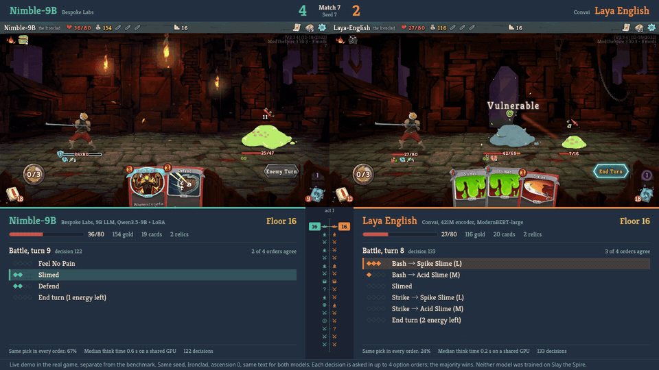
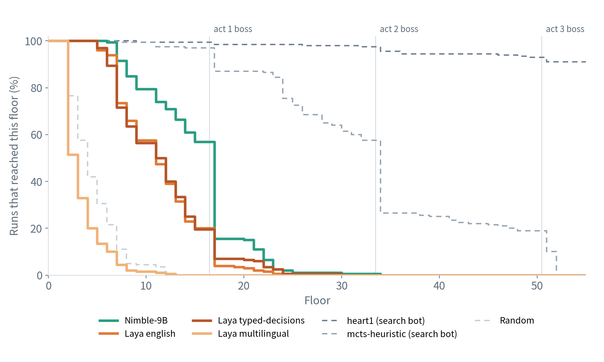
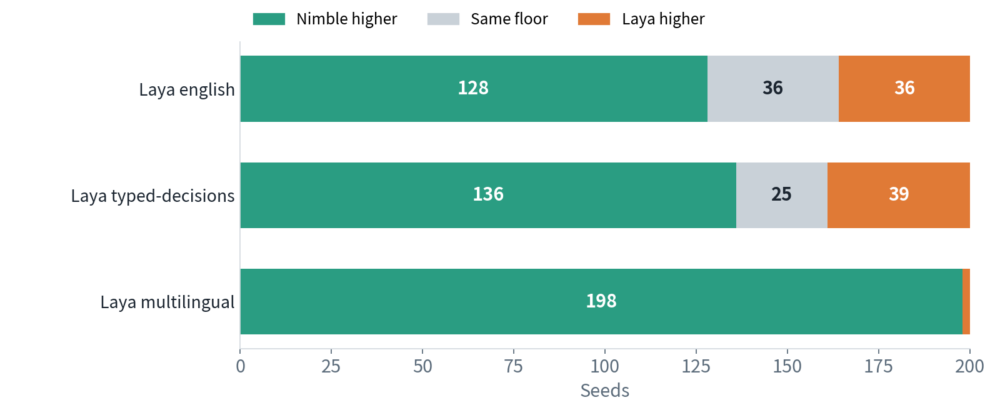
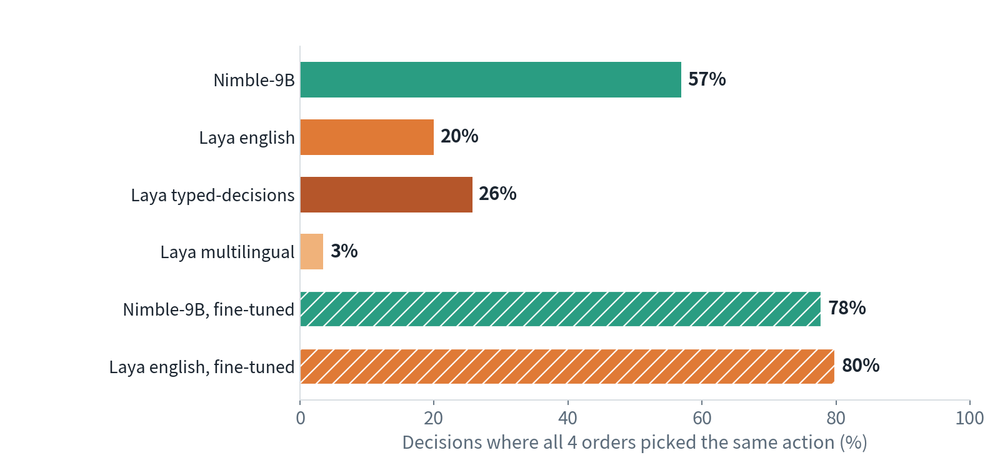
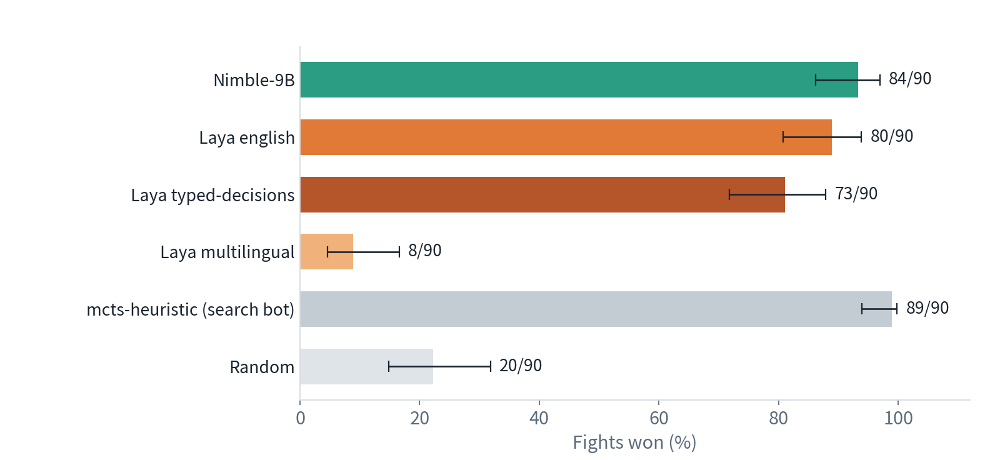
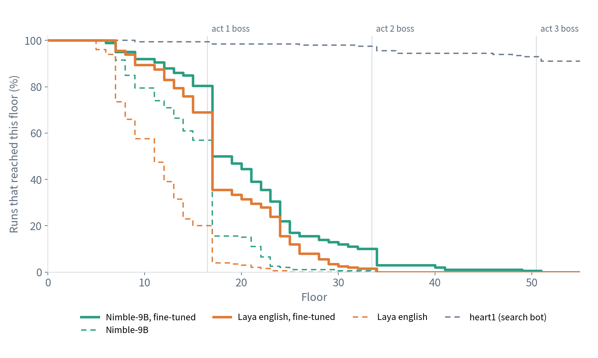

[English](README.md) · [한국어](README.ko.md) · [中文](README.zh-cn.md)

# typed-decision-slay-the-spire

This repository has a typed-decision model make every choice of a Slay the Spire run on a headless simulator, from the opening blessing and card rewards to each card played in combat.

We served Bespoke Nimble-9B and three Convai Laya checkpoints with model-compose on an NVIDIA DGX Spark and had each play the same 200 seeds as the Ironclad at ascension 0, reading identical text. We compared them twice: zero-shot, and after fine-tuning Nimble-9B and Laya english once on the same decisions of a search bot. Both rounds and their analyses were pre-registered before they ran. Every number comes from the runs; nothing was judged by hand. We measured on the DGX Spark only.

## Contents

- [Quick Start](#quick-start)
- [Summary](#summary)
- [1 Setup](#1-setup)
- [2 What it takes to run](#2-what-it-takes-to-run)
- [3 Results](#3-results)
  - [3.1 How far each model gets](#31-how-far-each-model-gets)
  - [3.2 Does the model read the options?](#32-does-the-model-read-the-options)
  - [3.3 The same elite fight](#33-the-same-elite-fight)
  - [3.4 Rewording the question](#34-rewording-the-question)
  - [3.5 After fine-tuning](#35-after-fine-tuning)
- [4 Recommendations](#4-recommendations)
- [5 Limitations and what we did not measure](#5-limitations-and-what-we-did-not-measure)
- [License](#license)

## Models

A typed-decision model takes a text and a list of allowed answers and returns one of them, with a probability for each. It never writes free text, so it cannot answer outside the list.

| Player | Model | Size | How it picks |
|---|---|---|---|
| `nimble` | [`bespokelabs/Bespoke-Nimble-9B`](https://huggingface.co/bespokelabs/Bespoke-Nimble-9B), a LoRA adapter on [`Qwen/Qwen3.5-9B`](https://huggingface.co/Qwen/Qwen3.5-9B) | 9B | Reads the answer letters' logits from a language model |
| `laya-english` | [`convaiinnovations/laya`](https://huggingface.co/convaiinnovations/laya), english checkpoint | 421M | Encoder (ModernBERT-large) with a choice head |
| `laya-typed` | the same repository, typed-decisions checkpoint (english, fine-tuned by Convai on four business workflows) | 421M | Same |
| `laya-multilingual` | the same repository, multilingual checkpoint | 322M | Same |
| `nimble-ft` | [`MindrLabs/sts-arena-nimble-ft`](https://huggingface.co/MindrLabs/sts-arena-nimble-ft): Nimble-9B's adapter trained one more epoch on this game | 9B | Same as Nimble-9B |
| `laya-english-ft` | [`MindrLabs/sts-arena-laya-english-ft`](https://huggingface.co/MindrLabs/sts-arena-laya-english-ft): Laya english fully fine-tuned for one epoch on this game | 421M | Same as Laya english |

## Demo



A live demo in the real game, separate from the benchmark: Nimble-9B (left) and Laya english (right) on the same seed, both at the act 1 boss. Below each game are the options of the current decision and how many of the 4 option orders picked each.

## Quick Start

It needs [model-compose](https://github.com/hanyeol/model-compose) 0.4.113 or later, [uv](https://docs.astral.sh/uv/), CMake 3.19+ and a C++20 compiler. We ran it on Linux with an NVIDIA GPU (DGX Spark).

Install model-compose with uv:

```bash
uv pip install model-compose
```

Or with pip:

```bash
pip install model-compose
```

Clone this repository and prepare it:

```bash
git clone https://github.com/MindrLabs/typed-decision-slay-the-spire
cd typed-decision-slay-the-spire
scripts/fetch-game-text.sh      # the game text the models read, into data/sts1
scripts/setup-simulator.sh      # builds the simulator and the runner's .venv
scripts/setup-runtimes.sh       # the model runtimes, with the packages the published runs used
```

Start the models:

```bash
model-compose up
```

In a second terminal, have a model play seed 1:

```bash
uv run python -m arena.run --player nimble --seeds 1 --perms 4
```

The run writes `runs/nimble/games.jsonl` (one line per game: floor, outcome, decision count) and `runs/nimble/seed-1.jsonl` (every decision: the state and options the model read, its pick in each option order, and the majority pick). `--player` takes any name in the [Models](#models) table, or `random`. `--perms 4` is the pre-registered setting: each decision is asked in 4 option orders and the majority wins. Leave it out to ask once in the simulator's order.

The gradio interface opens on `http://localhost:8081` and the HTTP API on `http://localhost:8080/api`.
`SERVER_PORT` and `PORT` change each port; the runner reads the API address from `ARENA_SERVER`.

| On the first run | What happens |
| :---: | --- |
| Game text | `fetch-game-text.sh` downloads five files (cards, relics, potions, events, monsters) from [spire-archive](https://github.com/nkhoit/spire-archive) at `687e6dce` and checks their sha256. The text belongs to the game, so this repository does not include it |
| Simulator | `setup-simulator.sh` clones [sts_lightspeed](https://github.com/daniel-ziegler/sts_lightspeed) at `84ab3ead`, applies the five commits in `patches/sts_dz`, creates the runner's `.venv` with uv, and builds the `slaythespire` Python module into it |
| Virtual environments | `setup-runtimes.sh` builds one environment per model under `.runtime/` from `runtimes/nimble.txt` and `runtimes/laya.txt` (torch 2.14.0 for both) |
| Checkpoints | Each model loads on its first request. Nimble-9B downloads its adapter (0.19 GB) and `Qwen/Qwen3.5-9B` (19.3 GB) and merges them once into `~/.cache/models/nimble-merged` (18.8 GB). The three Laya models share `convaiinnovations/laya` (2.4 GB). No token is needed for these; `HF_TOKEN` only raises the download rate limit |

The two search bots in the results play without a model server:

```bash
scripts/setup-simulator.sh --heart1      # downloads heart1's checkpoint (23 MB)
uv run --extra baselines python -m arena.bench --players mcts-heuristic,heart1 --seeds 1-200 --out runs/main
```

To rerun a whole round, or to recompute every table and figure below from the files in `results/`:

```bash
uv run python -m arena.bench --players nimble,laya-english,laya-typed,laya-multilingual \
  --seeds 1-200 --perms 4 --workers nimble=4 --out runs/final
uv run python scripts/stats.py results/final --refs results/main --single results/main \
  --wording results/wording --elite results/elite --latency results/latency --out reports/round1
uv run python scripts/stats_round2.py --out reports/round2
uv run python scripts/charts.py
```

Example request:

```bash
curl localhost:8080/api/workflows/runs -H 'Content-Type: application/json' -d '{
  "workflow_id": "nimble",
  "input": {
    "text": "Floor 5, campfire. HP 31/80. Next floor: an elite fight.",
    "schema": {"pick": {"type": "enum", "choices": ["A", "B"],
      "description": "Which option gives the best chance of winning this Slay the Spire run?",
      "choice_descriptions": {"A": "Rest: heal 24 HP.", "B": "Smith: upgrade Bash."}}}
  }
}'
```

It returns `{"decision": {"pick": "A"}, "fields": {"pick": {"scores": {"A": 0.62, "B": 0.38}}}}`. The Laya workflows take the same question as `{"type": "choice", "instructions": ..., "criteria": {"A": ..., "B": ...}}`.

## Summary

1. Without training, Nimble-9B climbed higher than every Laya model: a mean of floor 14.1, against 10.4 for Laya english, 10.6 for typed-decisions and 2.4 for multilingual. On the same seed it beat Laya english 128 times, tied 36 and lost 36. No text model won a run. The search bot heart1 averaged floor 53 and won 165 of 200.
2. Nimble-9B reads the options more. Asked the same decision with the options in 4 different orders, it picked the same action every time in 57% of decisions; Laya english did in 20%, typed-decisions in 26% and multilingual in 3%. Taking the majority over the 4 orders raised Nimble-9B by 1.2 floors, left Laya english and typed-decisions where they were, and dropped multilingual from 5.8 to 2.4: its earlier score came from favouring the first options.
3. Put in the same act 1 elite fight with the same deck, Nimble-9B and Laya english won about equally often (84 and 80 of 90). The gap between them builds up over a run's other choices, not inside one fight.
4. Fine-tuned once on the same 39,884 decisions of the search bot, Laya english rose 6.7 floors (10.4 to 17.1) and Nimble-9B 5.4 (14.1 to 19.5). Fine-tuned Nimble-9B still led by 2.4 floors. Both then picked the same action in every order in about 80% of decisions. Neither won a run.
5. Laya answers in a sixth of the time and memory: 24 ms per request and about 3 GB on the DGX Spark, against 146 ms and 19 GB for Nimble-9B.

Table 1: Summary by model (200 seeds each, 4 option orders per decision)

| Model | Mean floor, zero-shot | Mean floor, fine-tuned | Same pick in all 4 orders, zero-shot → fine-tuned | Per request | GPU memory |
|---|---|---|---|---|---|
| Nimble-9B | 14.1 | 19.5 | 57% → 78% | 146 ms | 19 GB |
| Laya english | 10.4 | 17.1 | 20% → 80% | 24 ms | about 3 GB |
| Laya typed-decisions | 10.6 | Not trained | 26% | 24 ms | about 3 GB |
| Laya multilingual | 2.4 | Not trained | 3% | 14 ms | about 3 GB |
| For reference: heart1 (search bot) | 53.2, 165 wins | | | | |

## 1 Setup

Table 2: Device and software

| Item | Value |
|---|---|
| Device | NVIDIA DGX Spark: GB10, driver 580.126.09, CUDA 13.0, 128 GB unified memory. Shared with other jobs |
| Model server | model-compose `e8ce0d4b` (round 1) and the same plus local commit `3f31d447` (round 2). This repository runs the same models with model-compose 0.4.113 from PyPI |
| Model runtimes | torch 2.14.0 for both families; Nimble-9B with flash-linear-attention 0.5.2, Laya with `laya` 0.3.20 (`runtimes/*.txt`) |
| Weights | Nimble-9B adapter `bd792f44` on `Qwen/Qwen3.5-9B` `c2022362`; Laya `55cf4c4e` (model-compose does not take a Laya revision, so it is recorded, not pinned) |
| Simulator | sts_lightspeed, Daniel Ziegler's fork of gamerpuppy's C++ reimplementation of Slay the Spire, at `84ab3ead` plus five commits that expose more game state to Python |
| Runs | Ironclad, ascension 0, seeds 1-200 for every player |

- **What the model reads.** Each decision is a text state (floor, HP, gold, deck, relics, potions; in combat also the hand, energy, and each enemy's HP, intent and powers) and a list of options written as sentences, with card, relic and event descriptions taken from the game text. Every model gets the same text. Option texts are fitted once with the ModernBERT tokenizer to 320 tokens; 1.6% of decisions had an option shortened.
- **What the model decides.** Everything, in and out of combat: the opening blessing, map path, card rewards, shop, campfire, events and each card or potion in a fight. The one exception is Match and Keep, a memory minigame with no option to describe, which the simulator's heuristic plays. Decisions with a single option are taken automatically.
- **4 option orders.** Each decision with 3 or more options is asked in 4 orders (two seeded shuffles and their reverses; 2 orders when there are only 2 options) and the action picked most often is played. Ties go to the sum of each order's ranking, then to a seeded coin. A model that picks by position rather than content then cannot steer the game.
- **Reference players.** heart1 (silverbot's policy network out of combat, the simulator's battle search in combat) and mcts-heuristic (the simulator's heuristic and battle search) play the same seeds without reading any text. Their search samples the cards still to be drawn and other random outcomes instead of reading them. They are a ceiling for scale, not competitors. random picks uniformly.
- **Pre-registration.** The models, seeds, settings, primary comparisons and statistics were published before each round ran: [round 1](https://gist.github.com/kecan0406/5816965b9711d07509ab91c291dda7d7), [round 2](https://gist.github.com/kecan0406/aa20d9488e25d78ee508e2fe525d4c4d). Floors are compared seed by seed with a paired bootstrap (10,000 resamples) and a Wilcoxon test, Holm-corrected over each round's three primary comparisons.

The published decisions replay exactly with this repository. On seed 1, every decision of the four zero-shot models came out the same (Nimble-9B 207, Laya english 134, typed-decisions 124, multilingual 13), and both search bots ended on the same floor. That needs `setup-runtimes.sh`: without it, model-compose installs newer packages, and while Laya english still matched, Nimble-9B's scores moved in the third decimal place, a near-tie vote flipped at decision 13, and the game went another way.

## 2 What it takes to run

Table 3: Time per decision on the DGX Spark (one model loaded at a time, 500 decisions replayed from the published games)

| Model | Per request, median / p95 | Per decision (4 orders), median / p95 | GPU memory |
|---|---|---|---|
| Nimble-9B | 146 / 187 ms | 581 / 739 ms | 19 GB |
| Nimble-9B, fine-tuned | 172 / 235 ms | 681 / 934 ms | 19 GB |
| Laya english | 24 / 29 ms | 96 / 117 ms | about 3 GB |
| Laya english, fine-tuned | 27 / 49 ms | 111 / 168 ms | about 3 GB |
| Laya typed-decisions | 24 / 30 ms | 97 / 123 ms | about 3 GB |
| Laya multilingual | 14 / 39 ms | 56 / 108 ms | about 3 GB |

- One game of seed 1 took 20 s with Laya english (134 decisions) and about 2 minutes with Nimble-9B (207 decisions), not counting loading the model.
- A decision is up to 4 requests, one per option order, so it takes about 4 times a request.
- The fine-tuned models are slower per request because they reach deeper floors, where the state text is longer.
- Models loaded side by side share the GPU badly when busy. Nimble-9B went from 0.15 s to about 0.4 s per request while three Laya models were also busy, and Laya from 24 ms to about 250 ms next to a busy Nimble-9B. Run one model family at a time for long runs; the results do not depend on it.
- The first request to Nimble-9B after `model-compose up` waits for the model to load (about 1-2 minutes with the merged weights cached; the first merge also downloads 19.5 GB).

## 3 Results

Table 4: Results by question

| Question | Result |
|---|---|
| Which model gets further without training? | Nimble-9B, by 3.5 to 11.7 floors on average. Every Laya model trails it on the same seeds |
| Does the model read what the options say? | Nimble-9B mostly does: 57% of decisions get the same pick in all 4 orders. Laya english and typed-decisions do far less (20%, 26%), and multilingual picks by position (3%) |
| Where does the gap come from? | From the run as a whole. In the same elite fight with the same deck the two are about even |
| Does the ranking hold if the question is reworded? | Nimble-9B stays first. Laya typed-decisions loses its lead over english, and the two tie |
| How much does one round of fine-tuning help? | 5 to 7 floors for both. The smaller Laya gains more, Nimble-9B stays ahead |

### 3.1 How far each model gets

Table 5: Floor reached on seeds 1-200 (4 option orders, majority vote)

| Player | Mean floor ± SE | Cleared act 1 [95% CI] | Wins | Nimble-9B higher / same / lower | Mean difference, Nimble-9B − this [95% CI] |
|---|---|---|---|---|---|
| Nimble-9B | 14.12 ± 0.35 | 31 (15.5% [11.1, 21.2]) | 0 | | |
| Laya english | 10.45 ± 0.30 | 8 (4.0% [2.0, 7.7]) | 0 | 128 / 36 / 36 | +3.67 [+2.90, +4.46] |
| Laya typed-decisions | 10.64 ± 0.34 | 14 (7.0% [4.2, 11.4]) | 0 | 136 / 25 / 39 | +3.48 [+2.62, +4.31] |
| Laya multilingual | 2.39 ± 0.14 | 0 (0.0% [0.0, 1.9]) | 0 | 198 / 0 / 2 | +11.73 [+10.99, +12.47] |
| heart1 (search bot) | 53.24 ± 0.48 | 197 (98.5%) | 165 | | |
| mcts-heuristic (search bot) | 32.39 ± 0.81 | 174 (87.0%) | 20 | | |
| random | 3.56 ± 0.17 | 0 | 0 | | |

All three primary comparisons have Holm-corrected p < 0.0001. Nimble-9B's runs end most often at the act 1 boss (The Guardian 31, Hexaghost 31); Laya english's and typed-decisions' most often at an act 1 elite (Lagavulin 26 and 19, Gremlin Nob 22 and 16, 3 Sentries 20 and 17).



Figure 1 (DGX Spark): Share of the 200 runs that reached each floor. Act 1 ends at floor 16.



Figure 2 (DGX Spark): Nimble-9B against each Laya model on the same seed.

### 3.2 Does the model read the options?



Figure 3 (DGX Spark): Decisions asked in 4 option orders where all 4 picked the same action. Hatched bars are the fine-tuned models (Section 3.5).

A model that reads the options picks the same action whatever their order. Laya english and typed-decisions agree with themselves in a fifth to a quarter of decisions, and multilingual almost never: it picks by where an option sits.

Table 6: Asking once in the simulator's order against the majority of 4 orders (same 200 seeds)

| Model | One order | Majority of 4 | Difference [95% CI] |
|---|---|---|---|
| Nimble-9B | 12.89 | 14.12 | +1.23 [+0.45, +2.04] |
| Laya english | 10.44 | 10.45 | +0.01 [-0.68, +0.69] |
| Laya typed-decisions | 10.35 | 10.64 | +0.30 [-0.32, +0.92] |
| Laya multilingual | 5.79 | 2.39 | -3.40 [-3.95, -2.88] |

In the simulator's own order the first options in a fight are often attack cards such as Bash, so a model that leans towards early options does better there than its reading deserves. The vote removes that, which is why multilingual falls.

### 3.3 The same elite fight

We copied 90 act 1 elite fights (30 each of Gremlin Nob, Lagavulin and 3 Sentries) from mcts-heuristic's runs, with its deck, relics and potions, and had every player fight each one from the same state.



Figure 4 (DGX Spark): Elite fights won out of 90, with Wilson 95% intervals.

| Against Nimble-9B | Fights won only by Nimble-9B / only by this | McNemar p | HP left, difference [95% CI] |
|---|---|---|---|
| Laya english | 7 / 3 | 0.344 | +2.5 [-1.1, +5.9] |
| Laya typed-decisions | 13 / 2 | 0.0074 | +6.5 [+2.7, +10.3] |
| Laya multilingual | 76 / 0 | <0.0001 | +36.7 [+32.1, +41.3] |

With a good deck, Nimble-9B (84 of 90) and Laya english (80) win about equally. Yet Laya english's runs end at elites more often (Section 3.1). The gap builds up in the choices before the fight: the cards taken, the path and the HP kept. This reading is exploratory, not pre-registered.

### 3.4 Rewording the question

On seeds 1-50, the two questions the models are asked ("Which option gives the best chance of winning this Slay the Spire run?" and the battle one) were replaced by sentences with the same meaning and the same token count.

| Model | Original | Reworded | Difference [95% CI] |
|---|---|---|---|
| Nimble-9B | 13.74 | 13.32 | -0.42 [-1.72, +0.88] |
| Laya english | 10.48 | 10.26 | -0.22 [-1.44, +1.04] |
| Laya typed-decisions | 11.34 | 10.26 | -1.08 [-2.08, -0.10] |
| Laya multilingual | 2.86 | 2.72 | -0.14 [-0.62, +0.32] |

Nimble-9B stays first and ahead of each Laya model. The pre-registered check (the same order of all four models) fails, because Laya typed-decisions and english tie after the rewording.

### 3.5 After fine-tuning

The data are the decisions of heart1, the strongest reference player, on the states each model actually reaches: games played by heart1 (seeds 1001-1025), by zero-shot Laya english (1101-1265) and by zero-shot Nimble-9B (1301-1365), each decision labelled with heart1's move. That gave 39,884 training decisions; both models trained on exactly the same examples with the same option orders. Each model was trained once for one epoch with its maker's published settings and no search: Laya english as a full fine-tune (learning rate 2e-5), Nimble-9B by training its released LoRA adapter further with Bespoke's own trainer (learning rate 5e-5). None of these seeds is an evaluation seed.

Table 7: Fine-tuned against zero-shot, seeds 1-200

| Comparison | Higher / same / lower | Mean difference [95% CI] | Holm p |
|---|---|---|---|
| Laya english, fine-tuned vs zero-shot | 146 / 27 / 27 | +6.66 [+5.65, +7.70] | <0.0001 |
| Nimble-9B, fine-tuned vs zero-shot | 126 / 30 / 44 | +5.37 [+4.14, +6.57] | <0.0001 |
| Nimble-9B, fine-tuned vs Laya english, fine-tuned | 89 / 46 / 65 | +2.39 [+1.23, +3.54] | 0.0002 |



Figure 5 (DGX Spark): Share of runs that reached each floor. Solid lines are fine-tuned, dashed lines zero-shot.

| Model | Agreement with heart1 on held-out decisions, before → after | Training time | Cleared act 1 |
|---|---|---|---|
| Laya english | 0.255 → 0.573 | 0.46 h | 8 → 71 of 200 |
| Nimble-9B | 0.337 → 0.599 | 7.94 h | 31 → 100 of 200 |

- Half of fine-tuned Nimble-9B's runs pass act 1, and its best run reached floor 50. heart1 averages 53.
- Both fine-tuned models take the gold and relic of every reward screen. Zero-shot, Nimble-9B took the gold 77% of the time and Laya english 29%.

## 4 Recommendations

- **No training data**: Use Nimble-9B. It reads the options well enough to play a long game it was not trained on; Laya, as Convai itself says, is close to random zero-shot on an unfamiliar task.
- **Tight latency or memory, and data to train on**: Fine-tune Laya english. One epoch on 40k examples (27 minutes on the DGX Spark) took it from 10.4 to 17.1 floors, close to fine-tuned Nimble-9B (19.5), at a sixth of the time per request and memory.
- **Before trusting a typed-decision model**: Ask a sample of decisions with the options in several orders. Low agreement means the model is picking by position, as Laya multilingual does here; its plain score can look better than its reading.
- **Multilingual Laya**: Do not use it on English tasks like this one without fine-tuning.
- **Reproducing a run**: Run `scripts/setup-runtimes.sh` before `model-compose up`. Fresh model-compose environments get newer packages, and a newer triton alone is enough to flip some of Nimble-9B's near-tie votes.

## 5 Limitations and what we did not measure

- One game, one character, one difficulty (Ironclad, ascension 0). The simulator reimplements the game and differs from it in places (for example Designer In-Spire, Scrap Ooze and Woman in Blue).
- Zero-shot Laya is used outside what Convai claims for it, and typed-decisions was fine-tuned for business workflows, not games. The models also differ about 20-fold in size (9B against 421M and 322M).
- Laya english reads at most 512 tokens and typed-decisions 1024, so their long states are cut. Laya multilingual and Nimble-9B read up to 4096.
- Fine-tuning used one method per model, the makers' published settings and one epoch. We do not know how far either model goes with other methods or more data.
- `nimble-ft` asked 12 decisions with more than 26 options over the 200 seeds. model-compose 0.4.113 refuses those; the published run used a local patch that builds such prompts with the checkpoint's own `serving_schema`, which [hanyeol/model-compose#29](https://github.com/hanyeol/model-compose/pull/29) (open as of 2026-10-01) brings to model-compose. Until it is released, `nimble-ft` needs model-compose from that pull request. With it, 23 of 23 decisions we checked picked as the published server did; we did not replay whole games with it.
- We measured only on the DGX Spark, a machine shared with other jobs. Times are with one model loaded at a time. RTX-class GPUs, Macs and Laya's TileLang fast path (x86-64 only) were not tried.
- The search bots are not competitors: they search the simulator, which no text model can.
- The question wording is ours. Section 3.4 shows the Laya models' order depends on it.
- The decision logs quote the game text, so `results/` keeps only per-game summaries and, per decision, its kind, option count, pick and votes. The tables above are recomputed from those files.
- The live demo (Demo) runs the real game and is not part of the benchmark.

## License

| Covers | License | Commercial use |
| :---: | --- | :---: |
| This repository | [`LICENSE`](LICENSE) (MIT) | ✓ |
| `bespokelabs/Bespoke-Nimble-9B`, `Qwen/Qwen3.5-9B` weights | Apache-2.0 | ✓ |
| `convaiinnovations/laya` weights | Apache-2.0 | ✓ |
| `MindrLabs/sts-arena-*-ft` weights | see each model card | see each model card |
| sts_lightspeed (the simulator, built by `setup-simulator.sh`) | MIT | ✓ |
| Game text (spire-archive, downloaded by `fetch-game-text.sh`) | none; it belongs to Mega Crit and is not included | ✗ |
| Game footage in the demo | Slay the Spire © Mega Crit | ✗ |
