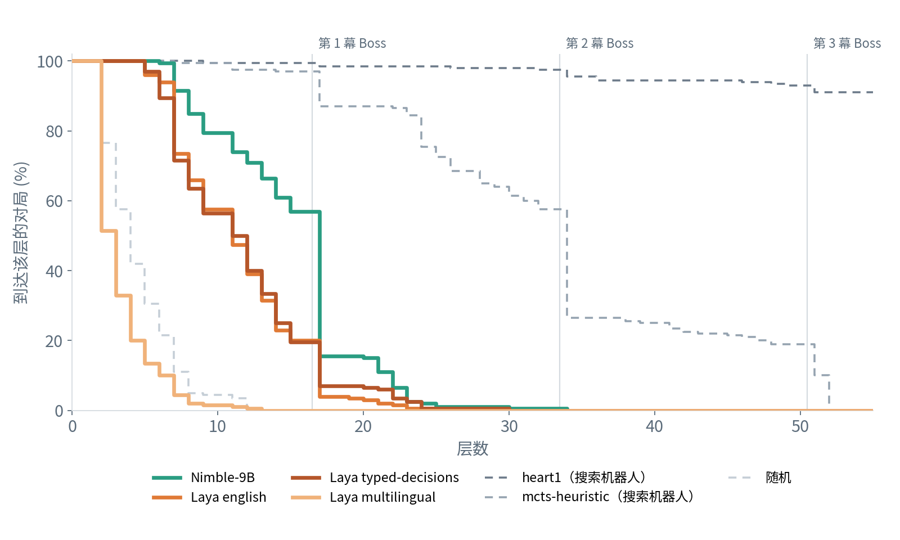
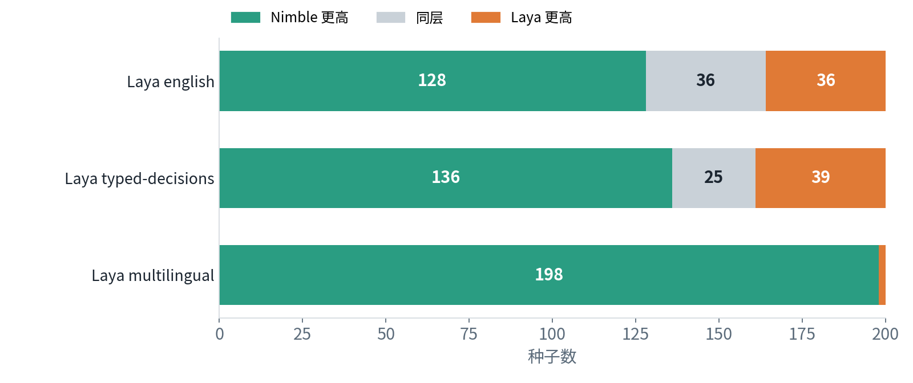
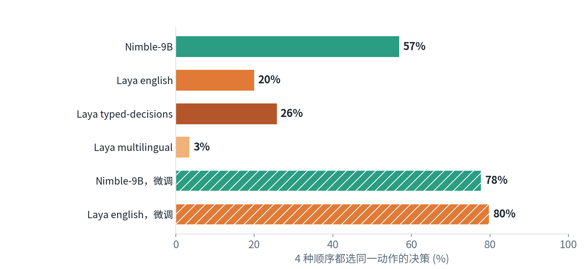
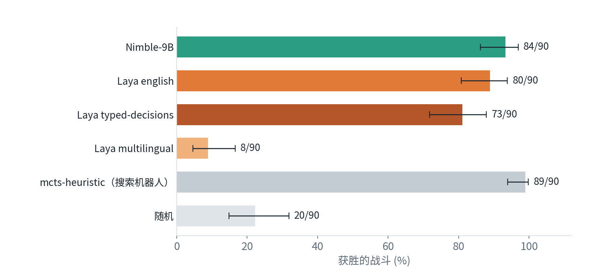
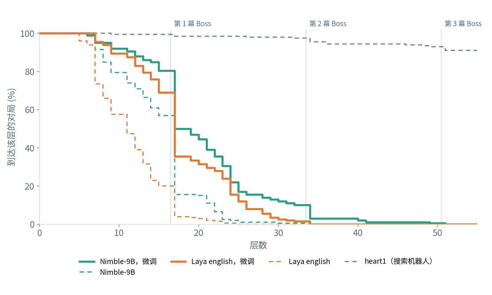

[English](README.md) · [한국어](README.ko.md) · [中文](README.zh-cn.md)

# typed-decision-slay-the-spire

这个仓库让 typed-decision 模型在无界面模拟器上做出《杀戮尖塔》（Slay the Spire）一局中的全部选择，从开局祝福、卡牌奖励到战斗中打出的每一张牌。

我们用 model-compose 部署 Bespoke Nimble-9B 和 Convai 的三个 Laya 检查点，在 NVIDIA DGX Spark 上运行。所有模型读取相同的文本，用铁甲战士在进阶 0 下打同样的 200 个种子。我们比较了两次：一次不经训练（zero-shot），一次是把 Nimble-9B 和 Laya english 用搜索机器人的同一批决策各微调一次之后。两轮都在运行前预先登记了设置和分析方法。所有数字都来自运行结果，没有任何人工判定。只在 DGX Spark 上测量。

## 目录

- [快速开始](#快速开始)
- [摘要](#摘要)
- [1 实验环境](#1-实验环境)
- [2 运行需要什么](#2-运行需要什么)
- [3 结果](#3-结果)
  - [3.1 各模型能走多远](#31-各模型能走多远)
  - [3.2 模型读选项吗](#32-模型读选项吗)
  - [3.3 同一场精英战](#33-同一场精英战)
  - [3.4 换一种问法](#34-换一种问法)
  - [3.5 微调之后](#35-微调之后)
- [4 建议](#4-建议)
- [5 局限与未测量的内容](#5-局限与未测量的内容)
- [许可证](#许可证)

## 模型

typed-decision 模型接收一段文本和一组允许的答案，从中选出一个，并给每个答案一个概率。它不写自由文本，因此不会给出列表以外的答案。

| 玩家 | 模型 | 规模 | 选择方式 |
|---|---|---|---|
| `nimble` | [`bespokelabs/Bespoke-Nimble-9B`](https://huggingface.co/bespokelabs/Bespoke-Nimble-9B)，加在 [`Qwen/Qwen3.5-9B`](https://huggingface.co/Qwen/Qwen3.5-9B) 上的 LoRA 适配器 | 9B | 读取语言模型对答案字母的 logit |
| `laya-english` | [`convaiinnovations/laya`](https://huggingface.co/convaiinnovations/laya) 的 english 检查点 | 421M | 编码器（ModernBERT-large）加选择头 |
| `laya-typed` | 同一仓库的 typed-decisions 检查点（Convai 用四种业务流程对 english 微调而成） | 421M | 同上 |
| `laya-multilingual` | 同一仓库的 multilingual 检查点 | 322M | 同上 |
| `nimble-ft` | [`MindrLabs/sts-arena-nimble-ft`](https://huggingface.co/MindrLabs/sts-arena-nimble-ft)：把 Nimble-9B 的适配器在本游戏上再训练 1 个 epoch | 9B | 与 Nimble-9B 相同 |
| `laya-english-ft` | [`MindrLabs/sts-arena-laya-english-ft`](https://huggingface.co/MindrLabs/sts-arena-laya-english-ft)：Laya english 在本游戏上全参数微调 1 个 epoch | 421M | 与 Laya english 相同 |

## 演示


这是在真实游戏里运行的演示，与基准测试无关：Nimble-9B（左）和 Laya english（右）打同一个种子，双方都在第 1 幕 Boss 战。每局游戏下方显示当前决策的选项，以及 4 种选项顺序中有几次选了它。

## 快速开始

需要 [model-compose](https://github.com/hanyeol/model-compose) 0.4.113 或更高版本、[uv](https://docs.astral.sh/uv/)、CMake 3.19 以上和 C++20 编译器。我们在带 NVIDIA GPU 的 Linux（DGX Spark）上运行。

用 uv 安装 model-compose：

```bash
uv pip install model-compose
```

或者用 pip：

```bash
pip install model-compose
```

克隆并准备本仓库：

```bash
git clone https://github.com/MindrLabs/typed-decision-slay-the-spire
cd typed-decision-slay-the-spire
scripts/fetch-game-text.sh      # 下载模型读取的游戏文本到 data/sts1
scripts/setup-simulator.sh      # 构建模拟器和运行器的 .venv
scripts/setup-runtimes.sh       # 用公开运行时的软件包创建模型运行环境
```

启动模型：

```bash
model-compose up
```

在另一个终端让模型打种子 1：

```bash
uv run python -m arena.run --player nimble --seeds 1 --perms 4
```

运行会写出 `runs/nimble/games.jsonl`（每局一行：到达层数、结果、决策数）和 `runs/nimble/seed-1.jsonl`（每个决策：模型读到的状态和选项、每种顺序下的选择、多数票结果）。`--player` 可以填[模型](#模型)表中的任一名称或 `random`。`--perms 4` 是预先登记的设置：每个决策用 4 种选项顺序提问，多数票胜出。去掉它则按模拟器的顺序只问一次。

gradio 界面在 `http://localhost:8081`，HTTP API 在 `http://localhost:8080/api`。
`SERVER_PORT` 和 `PORT` 分别修改端口；运行器从 `ARENA_SERVER` 读取 API 地址。

| 首次运行 | 做什么 |
| :---: | --- |
| 游戏文本 | `fetch-game-text.sh` 从 [spire-archive](https://github.com/nkhoit/spire-archive) 的 `687e6dce` 下载 5 个文件（卡牌、遗物、药水、事件、怪物）并校验 sha256。这些文本属于游戏，因此本仓库不包含它们 |
| 模拟器 | `setup-simulator.sh` 克隆 [sts_lightspeed](https://github.com/daniel-ziegler/sts_lightspeed) 的 `84ab3ead`，应用 `patches/sts_dz` 中的 5 个提交，用 uv 创建运行器的 `.venv`，并把 `slaythespire` Python 模块构建进去 |
| 虚拟环境 | `setup-runtimes.sh` 按 `runtimes/nimble.txt` 和 `runtimes/laya.txt` 在 `.runtime/` 下为每个模型建一个环境（两者都是 torch 2.14.0） |
| 检查点 | 每个模型在第一次请求时加载。Nimble-9B 下载适配器（0.19 GB）和 `Qwen/Qwen3.5-9B`（19.3 GB），只合并一次，存到 `~/.cache/models/nimble-merged`（18.8 GB）。三个 Laya 模型共用 `convaiinnovations/laya`（2.4 GB）。这些模型不需要 token，`HF_TOKEN` 只用于提高下载限速 |

结果中的两个搜索机器人不需要模型服务器：

```bash
scripts/setup-simulator.sh --heart1      # 下载 heart1 的检查点（23 MB）
uv run --extra baselines python -m arena.bench --players mcts-heuristic,heart1 --seeds 1-200 --out runs/main
```

要重跑一整轮，或者从 `results/` 中的文件重新算出下面所有的表和图：

```bash
uv run python -m arena.bench --players nimble,laya-english,laya-typed,laya-multilingual \
  --seeds 1-200 --perms 4 --workers nimble=4 --out runs/final
uv run python scripts/stats.py results/final --refs results/main --single results/main \
  --wording results/wording --elite results/elite --latency results/latency --out reports/round1
uv run python scripts/stats_round2.py --out reports/round2
uv run python scripts/charts.py
```

请求示例：

```bash
curl localhost:8080/api/workflows/runs -H 'Content-Type: application/json' -d '{
  "workflow_id": "nimble",
  "input": {
    "text": "Floor 5, campfire. HP 31/80. Next floor: an elite fight.",
    "schema": {"pick": {"type": "enum", "choices": ["A", "B"],
      "description": "Which option gives the best chance of winning this Slay the Spire run?",
      "choice_descriptions": {"A": "Rest: heal 24 HP.", "B": "Smith: upgrade Bash."}}}
  }
}'
```

返回 `{"decision": {"pick": "A"}, "fields": {"pick": {"scores": {"A": 0.62, "B": 0.38}}}}`。Laya 工作流用 `{"type": "choice", "instructions": ..., "criteria": {"A": ..., "B": ...}}` 接收同样的问题。

## 摘要

1. 不经训练时，Nimble-9B 爬得比所有 Laya 模型都高：平均到达第 14.1 层，Laya english 为 10.4，typed-decisions 为 10.6，multilingual 为 2.4。在同一种子上，它对 Laya english 赢 128 次、平 36 次、输 36 次。没有任何文本模型赢下一局。搜索机器人 heart1 平均到达第 53 层，200 局赢 165 局。
2. Nimble-9B 更会读选项。同一个决策只把选项顺序换成 4 种来问，它在 57% 的决策中每次都选同一个动作；Laya english 为 20%，typed-decisions 为 26%，multilingual 为 3%。改用 4 种顺序的多数票后，Nimble-9B 上升 1.2 层，Laya english 和 typed-decisions 不变，multilingual 从 5.8 层降到 2.4 层：它原来的分数来自偏爱靠前的选项。
3. 用同一副牌打同一场第 1 幕精英战时，Nimble-9B 和 Laya english 胜率相近（90 场中分别赢 84 和 80 场）。两者的差距不是在一场战斗里拉开的，而是在一局中其他选择上积累起来的。
4. 用搜索机器人的同一批 39,884 个决策各微调一次后，Laya english 上升 6.7 层（10.4 到 17.1），Nimble-9B 上升 5.4 层（14.1 到 19.5）。微调后的 Nimble-9B 仍领先 2.4 层。两者都在约 80% 的决策中对所有顺序选同一个动作。仍然没有赢下一局。
5. Laya 只用六分之一的时间和内存：在 DGX Spark 上每次请求 24 ms、约 3 GB，Nimble-9B 为 146 ms、19 GB。

表 1：各模型概况（每个模型 200 个种子，每个决策 4 种选项顺序）

| 模型 | 平均层数，未训练 | 平均层数，微调后 | 4 种顺序都选同一动作，未训练 → 微调后 | 每次请求 | GPU 内存 |
|---|---|---|---|---|---|
| Nimble-9B | 14.1 | 19.5 | 57% → 78% | 146 ms | 19 GB |
| Laya english | 10.4 | 17.1 | 20% → 80% | 24 ms | 约 3 GB |
| Laya typed-decisions | 10.6 | 未训练 | 26% | 24 ms | 约 3 GB |
| Laya multilingual | 2.4 | 未训练 | 3% | 14 ms | 约 3 GB |
| 参考：heart1（搜索机器人） | 53.2，165 胜 | | | | |

## 1 实验环境

表 2：设备与软件

| 项目 | 值 |
|---|---|
| 设备 | NVIDIA DGX Spark：GB10，驱动 580.126.09，CUDA 13.0，128 GB 统一内存。与其他任务共用 |
| 模型服务器 | model-compose `e8ce0d4b`（第 1 轮），以及在其上加本地提交 `3f31d447` 的版本（第 2 轮）。本仓库用 PyPI 上的 model-compose 0.4.113 运行同样的模型 |
| 模型运行环境 | 两个系列都用 torch 2.14.0；Nimble-9B 加 flash-linear-attention 0.5.2，Laya 用 `laya` 0.3.20（`runtimes/*.txt`） |
| 权重 | Nimble-9B 适配器 `bd792f44`，基座 `Qwen/Qwen3.5-9B` `c2022362`；Laya `55cf4c4e`（model-compose 不接受 Laya 的 revision，因此只记录、无法固定） |
| 模拟器 | sts_lightspeed：gamerpuppy 用 C++ 重新实现的《杀戮尖塔》，Daniel Ziegler 的分支，版本 `84ab3ead`，另加 5 个向 Python 暴露更多游戏状态的提交 |
| 运行 | 铁甲战士，进阶 0，所有玩家都打种子 1-200 |

- **模型读到什么。** 每个决策是一段状态文本（层数、HP、金币、牌组、遗物、药水；战斗中还有手牌、能量以及每个敌人的 HP、意图和能力）和一组写成句子的选项，卡牌、遗物和事件的描述取自游戏文本。所有模型拿到相同的文本。选项文本用 ModernBERT 分词器统一截到 320 个 token，1.6% 的决策中有选项被缩短。
- **模型决定什么。** 战斗内外的一切：开局祝福、地图路线、卡牌奖励、商店、篝火、事件，以及战斗中的每张牌和每瓶药水。唯一的例外是记忆小游戏 Match and Keep，它没有可描述的选项，由模拟器的启发式算法来下。只有一个选项的决策自动执行。
- **4 种选项顺序。** 有 3 个及以上选项的决策按 4 种顺序提问（两次由种子决定的打乱及其倒序；只有 2 个选项时为 2 种），执行被选次数最多的动作。平票时按各顺序排名得分之和决定，仍相同则按种子抽签。这样，按位置而不是按内容选择的模型就无法左右游戏。
- **参考玩家。** heart1（战斗外用 silverbot 的策略网络，战斗中用模拟器的战斗搜索）和 mcts-heuristic（模拟器的启发式算法加战斗搜索）不读任何文本，打同样的种子。它们的搜索对尚未抽到的牌和其他随机结果进行采样，而不是直接读取。它们是用来衡量尺度的上限，不是竞争对手。random 均匀随机选择。
- **预先登记。** 每轮运行前都公开了模型、种子、设置、主要比较和统计方法：[第 1 轮](https://gist.github.com/kecan0406/5816965b9711d07509ab91c291dda7d7)、[第 2 轮](https://gist.github.com/kecan0406/aa20d9488e25d78ee508e2fe525d4c4d)。层数按种子配对比较，使用配对 bootstrap（10,000 次重采样）和 Wilcoxon 检验，并对每轮的三个主要比较做 Holm 校正。

用本仓库可以原样重现公开的决策。在种子 1 上，四个未训练模型的决策全部相同（Nimble-9B 207 个、Laya english 134 个、typed-decisions 124 个、multilingual 13 个），两个搜索机器人也停在同一层。前提是先运行 `setup-runtimes.sh`：不运行时 model-compose 会安装更新的软件包，Laya english 仍然一致，但 Nimble-9B 的分数在小数点后第三位发生变化，第 13 个决策中一张接近平票的投票翻转，游戏走向了另一条路。

## 2 运行需要什么

表 3：DGX Spark 上每个决策的时间（每次只加载一个模型，重放公开对局中的 500 个决策）

| 模型 | 每次请求，中位数 / p95 | 每个决策（4 种顺序），中位数 / p95 | GPU 内存 |
|---|---|---|---|
| Nimble-9B | 146 / 187 ms | 581 / 739 ms | 19 GB |
| Nimble-9B，微调 | 172 / 235 ms | 681 / 934 ms | 19 GB |
| Laya english | 24 / 29 ms | 96 / 117 ms | 约 3 GB |
| Laya english，微调 | 27 / 49 ms | 111 / 168 ms | 约 3 GB |
| Laya typed-decisions | 24 / 30 ms | 97 / 123 ms | 约 3 GB |
| Laya multilingual | 14 / 39 ms | 56 / 108 ms | 约 3 GB |

- 种子 1 的一局，Laya english 用了 20 秒（134 个决策），Nimble-9B 约 2 分钟（207 个决策），不含加载模型的时间。
- 一个决策按每种选项顺序各请求一次，最多 4 次，所以耗时约为单次请求的 4 倍。
- 微调后的模型能走到更深的层，那里的状态文本更长，所以每次请求更慢。
- 同时加载的多个模型一起忙碌时，共享 GPU 会大幅变慢。三个 Laya 模型同时忙碌时，Nimble-9B 每次请求从 0.15 秒变成约 0.4 秒；在忙碌的 Nimble-9B 旁边，Laya 从 24 ms 变成约 250 ms。长时间运行请按模型系列依次进行，结果与顺序无关。
- `model-compose up` 之后对 Nimble-9B 的第一次请求要等模型加载（合并后的权重已缓存时约 1-2 分钟；第一次合并还要下载 19.5 GB）。

## 3 结果

表 4：按问题整理的结果

| 问题 | 结果 |
|---|---|
| 不经训练，谁走得更远？ | Nimble-9B，平均多走 3.5-11.7 层。在相同种子上所有 Laya 模型都落后于它 |
| 模型会读选项的内容吗？ | Nimble-9B 大多会读：57% 的决策在 4 种顺序下选择相同。Laya english 和 typed-decisions 读得少得多（20%、26%），multilingual 按位置选择（3%） |
| 差距从哪里来？ | 来自整局。用同一副牌打同一场精英战时两者相近 |
| 换一种问法，排名还成立吗？ | Nimble-9B 仍是第一。Laya typed-decisions 失去了对 english 的领先，两者打平 |
| 微调一次能提高多少？ | 两者都提高 5-7 层。较小的 Laya 提高更多，Nimble-9B 仍然领先 |

### 3.1 各模型能走多远

表 5：种子 1-200 的到达层数（4 种选项顺序，多数票）

| 玩家 | 平均层数 ± SE | 通过第 1 幕 [95% CI] | 胜局 | Nimble-9B 更高 / 相同 / 更低 | 平均差，Nimble-9B − 该模型 [95% CI] |
|---|---|---|---|---|---|
| Nimble-9B | 14.12 ± 0.35 | 31 (15.5% [11.1, 21.2]) | 0 | | |
| Laya english | 10.45 ± 0.30 | 8 (4.0% [2.0, 7.7]) | 0 | 128 / 36 / 36 | +3.67 [+2.90, +4.46] |
| Laya typed-decisions | 10.64 ± 0.34 | 14 (7.0% [4.2, 11.4]) | 0 | 136 / 25 / 39 | +3.48 [+2.62, +4.31] |
| Laya multilingual | 2.39 ± 0.14 | 0 (0.0% [0.0, 1.9]) | 0 | 198 / 0 / 2 | +11.73 [+10.99, +12.47] |
| heart1（搜索机器人） | 53.24 ± 0.48 | 197 (98.5%) | 165 | | |
| mcts-heuristic（搜索机器人） | 32.39 ± 0.81 | 174 (87.0%) | 20 | | |
| random | 3.56 ± 0.17 | 0 | 0 | | |

三个主要比较的 Holm 校正 p 值都小于 0.0001。Nimble-9B 的对局最常在第 1 幕 Boss 处结束（The Guardian 31 局、Hexaghost 31 局）；Laya english 和 typed-decisions 的对局最常在第 1 幕精英处结束（Lagavulin 26 和 19 局、Gremlin Nob 22 和 16 局、3 Sentries 20 和 17 局）。



图 1（DGX Spark）：200 局中到达各层的对局比例。第 1 幕在第 16 层结束。



图 2（DGX Spark）：在同一种子上比较 Nimble-9B 与每个 Laya 模型。

### 3.2 模型读选项吗



图 3（DGX Spark）：用 4 种选项顺序提问的决策中，4 次都选同一动作的比例。斜线条是微调后的模型（第 3.5 节）。

会读选项的模型，无论顺序如何都会选同一个动作。Laya english 和 typed-decisions 只在五分之一到四分之一的决策中与自己一致，multilingual 几乎从不一致：它按选项所在的位置来选。

表 6：按模拟器顺序只问一次，与 4 种顺序多数票的对比（同样的 200 个种子）

| 模型 | 一种顺序 | 4 种顺序多数票 | 差 [95% CI] |
|---|---|---|---|
| Nimble-9B | 12.89 | 14.12 | +1.23 [+0.45, +2.04] |
| Laya english | 10.44 | 10.45 | +0.01 [-0.68, +0.69] |
| Laya typed-decisions | 10.35 | 10.64 | +0.30 [-0.32, +0.92] |
| Laya multilingual | 5.79 | 2.39 | -3.40 [-3.95, -2.88] |

在模拟器自己的顺序里，战斗中靠前的选项常常是 Bash 这样的攻击牌，所以偏爱靠前选项的模型在那里的表现会好于它真正的阅读能力。多数票消除了这一点，所以 multilingual 下降了。

### 3.3 同一场精英战

我们从 mcts-heuristic 的对局中复制了 90 场第 1 幕精英战（Gremlin Nob、Lagavulin、3 Sentries 各 30 场），连同它的牌组、遗物和药水，让每个玩家从同一状态打每一场。



图 4（DGX Spark）：90 场精英战中的胜场数及 Wilson 95% 区间。

| 与 Nimble-9B 对比 | 只有 Nimble-9B 赢 / 只有该模型赢 | McNemar p | 剩余 HP 差 [95% CI] |
|---|---|---|---|
| Laya english | 7 / 3 | 0.344 | +2.5 [-1.1, +5.9] |
| Laya typed-decisions | 13 / 2 | 0.0074 | +6.5 [+2.7, +10.3] |
| Laya multilingual | 76 / 0 | <0.0001 | +36.7 [+32.1, +41.3] |

拿到一副好牌时，Nimble-9B（90 场赢 84 场）和 Laya english（80 场）胜率相近。然而 Laya english 的对局更常在精英战结束（第 3.1 节）。差距是在战斗之前的选择中积累的：拿了哪些牌、走了哪条路、保住了多少 HP。这一解读是探索性的，没有预先登记。

### 3.4 换一种问法

在种子 1-50 上，我们把问模型的两个问题（"Which option gives the best chance of winning this Slay the Spire run?" 和战斗用的问题）换成意思相同、token 数相同的另一句话。

| 模型 | 原问法 | 新问法 | 差 [95% CI] |
|---|---|---|---|
| Nimble-9B | 13.74 | 13.32 | -0.42 [-1.72, +0.88] |
| Laya english | 10.48 | 10.26 | -0.22 [-1.44, +1.04] |
| Laya typed-decisions | 11.34 | 10.26 | -1.08 [-2.08, -0.10] |
| Laya multilingual | 2.86 | 2.72 | -0.14 [-0.62, +0.32] |

Nimble-9B 仍是第一，并高于每个 Laya 模型。预先登记的检查（四个模型顺序不变）未通过，因为换问法后 Laya typed-decisions 和 english 打平了。

### 3.5 微调之后

训练数据是最强的参考玩家 heart1 的决策，取自每个模型实际会到达的状态：heart1（种子 1001-1025）、未训练的 Laya english（1101-1265）和未训练的 Nimble-9B（1301-1365）所打对局中的决策，每个决策都标注 heart1 的选择。共得到 39,884 个训练决策；两个模型用完全相同的样本和相同的选项顺序训练。每个模型都按其开发者公开的设置训练一次、1 个 epoch，不做超参数搜索：Laya english 做全参数微调（学习率 2e-5），Nimble-9B 用 Bespoke 自己的训练代码继续训练已发布的 LoRA 适配器（学习率 5e-5）。这些种子与评估种子不重叠。

表 7：微调与未训练对比，种子 1-200

| 比较 | 更高 / 相同 / 更低 | 平均差 [95% CI] | Holm p |
|---|---|---|---|
| Laya english，微调 对 未训练 | 146 / 27 / 27 | +6.66 [+5.65, +7.70] | <0.0001 |
| Nimble-9B，微调 对 未训练 | 126 / 30 / 44 | +5.37 [+4.14, +6.57] | <0.0001 |
| Nimble-9B 微调 对 Laya english 微调 | 89 / 46 / 65 | +2.39 [+1.23, +3.54] | 0.0002 |



图 5（DGX Spark）：到达各层的对局比例。实线为微调后，虚线为未训练。

| 模型 | 在留出决策上与 heart1 的一致率，训练前 → 训练后 | 训练时间 | 通过第 1 幕 |
|---|---|---|---|
| Laya english | 0.255 → 0.573 | 0.46 小时 | 200 局中 8 → 71 |
| Nimble-9B | 0.337 → 0.599 | 7.94 小时 | 200 局中 31 → 100 |

- 微调后的 Nimble-9B 有一半对局通过第 1 幕，最远到达第 50 层。heart1 平均为 53 层。
- 两个微调模型在每个奖励界面都拿走了金币和遗物。未训练时，Nimble-9B 拿金币的比例为 77%，Laya english 为 29%。

## 4 建议

- **没有训练数据时**：用 Nimble-9B。它读选项的能力足以打完一局没训练过的长游戏；而 Laya 正如 Convai 自己所说，在陌生任务上未训练时接近随机。
- **延迟或内存吃紧、且有训练数据时**：微调 Laya english。用 4 万个样本训练 1 个 epoch（DGX Spark 上 27 分钟），它从 10.4 层升到 17.1 层，接近微调后的 Nimble-9B（19.5 层），而每次请求的时间和内存只有六分之一。
- **在信任 typed-decision 模型之前**：抽一些决策，把选项换几种顺序来问。一致率低说明模型按位置选择，就像这里的 Laya multilingual；它表面上的分数可能好于真实的阅读能力。
- **Laya multilingual**：未经微调不要用于这类英文任务。
- **重现运行时**：在 `model-compose up` 之前运行 `scripts/setup-runtimes.sh`。model-compose 新建的环境会装上更新的软件包，仅 triton 换成新构建就足以让 Nimble-9B 的一些接近平票的投票翻转。

## 5 局限与未测量的内容

- 只看了一个游戏、一个角色、一个难度（铁甲战士，进阶 0）。模拟器是对游戏的重新实现，有些地方行为不同（例如 Designer In-Spire、Scrap Ooze、Woman in Blue）。
- 未训练的 Laya 被用在 Convai 所声称的用途之外，typed-decisions 是为业务流程而非游戏微调的检查点。模型规模也相差约 20 倍（9B 对 421M 和 322M）。
- Laya english 最多读 512 个 token，typed-decisions 最多 1024 个，所以较长的状态会被截断。Laya multilingual 和 Nimble-9B 最多读 4096 个。
- 微调每个模型只用一种方法、开发者公开的设置和 1 个 epoch。用其他方法或更多数据能提高到什么程度，我们不知道。
- 在 200 个种子中，`nimble-ft` 遇到 12 个选项超过 26 个的决策。model-compose 0.4.113 会拒绝这类决策；公开运行用了一个本地补丁，用检查点自带的 `serving_schema` 构建这类提示词，[hanyeol/model-compose#29](https://github.com/hanyeol/model-compose/pull/29)（截至 2026-10-01 仍在审阅中）会把同样的功能加入 model-compose。在它发布之前，`nimble-ft` 需要使用这个 PR 的 model-compose。我们用它核对的 23 个决策与公开服务器的选择全部相同，但没有用它重放整局。
- 只在与其他任务共用的 DGX Spark 上测量，时间是每次只加载一个模型时测的。没有试过 RTX 系列 GPU、Mac 以及 Laya 的 TileLang 快速路径（仅限 x86-64）。
- 搜索机器人不是竞争对手：它们直接搜索模拟器，文本模型做不到。
- 问题的措辞由我们决定。第 3.4 节显示，Laya 模型之间的排序取决于措辞。
- 决策日志引用了游戏文本，因此 `results/` 只保留每局摘要，以及每个决策的类型、选项数、选择和投票。上面的表都是从这些文件重新计算的。
- 演示在真实游戏中运行，不属于基准测试。

## 许可证

| 对象 | 许可证 | 商业使用 |
| :---: | --- | :---: |
| 本仓库 | [`LICENSE`](LICENSE)（MIT） | ✓ |
| `bespokelabs/Bespoke-Nimble-9B`、`Qwen/Qwen3.5-9B` 权重 | Apache-2.0 | ✓ |
| `convaiinnovations/laya` 权重 | Apache-2.0 | ✓ |
| `MindrLabs/sts-arena-*-ft` 权重 | 见各模型卡片 | 见各模型卡片 |
| sts_lightspeed（`setup-simulator.sh` 构建的模拟器） | MIT | ✓ |
| 游戏文本（`fetch-game-text.sh` 下载的 spire-archive） | 无；属于 Mega Crit，本仓库不包含 | ✗ |
| 演示中的游戏画面 | Slay the Spire © Mega Crit | ✗ |
